# A cost floor for signal-return correlation: verification, limits, and calibration

**Abstract.** A published derivation bounds the minimum correlation a tradable
signal must have with future returns, on the argument that a signal too weak to
pay for the trade it implies cannot be acted upon. This study verifies the
derivation symbolically and by simulation, establishes which of its stated
consequences follow and which do not, identifies five conditions under which the
bound returns the wrong answer and one effect its model cannot represent,
restates the result in the units of a linear regression, and replaces the market
parameters it requires with measurements wherever the available data permits. One
does not: the bid-ask spread is not recoverable from the kline archive used here,
and it remains an explicit assumption, as Section 15.3 reports. The source is
recorded verbatim in [`SOURCE.md`](SOURCE.md) and cited in Section 11.

---

## Summary

A signal's correlation with future returns has no absolute scale. The thread
supplies one, in a single line of algebra: if even a three-standard-deviation
reading of the signal cannot pay the cost of the trade it implies, the signal
is unactionable, so

```math
\rho_{\min}=\frac{c}{3\,\sigma\sqrt{\tau}}.
```

Every step of that derivation checks out. Fifteen of the sixteen relations
involved hold exactly under symbolic verification; the sixteenth is the thread's
correlation formula itself, an approximation with $`O(\rho^{2})`$ relative error
that is immaterial at any correlation the thread discusses. All three worked
numbers reproduce: 0.556% for daily
US equity, 2.222% factor-hedged, 8.433% for one-minute FX. The first rule
of thumb reproduces too: $`1.5\times`$ the floor does put a trade in 4.55% of
periods against the stated "about 5%".

Two things do not survive. The second rule of thumb is optimistic by roughly a
factor of $`1.2`$ in correlation: $`2\times`$ the floor trades 13.4% of periods,
not the stated $`20`$ to 30%, which needs $`2.34`$ to $`2.89\times`$. And the framing
"you need to exceed these to be able to trade profitably" is stronger than the
model supports: with a no-trade band, expected net P&L is strictly positive
for *any* positive correlation, because a Gaussian signal always eventually
prints a big enough reading. The floor is not where profit turns negative. It
is where profit stops mattering: at the floor the rule trades 0.27% of
periods, keeps 0.10% of the costless gross P&L, and posts an annualised
information ratio of $`0.03`$ across five hundred independent names.

That reframing makes the result more useful, not less. What the floor
measures is how much of a signal's theoretical value the cost of trading
destroys, and the shortfall is severe even well above the floor: at $`2\times`$,
which the thread calls "very good", costs take 84% of the gross information
ratio.

Then there are the four assumptions doing silent work. The floor is a
statement about *Gaussian* signals: a sparse event signal with the identical
correlation earns up to $`109\times`$ more. It is a statement about a particular
*encoding*: the same information, re-encoded, moves from a correlation of
exactly zero to three times the floor. It is a statement about *average* cost
and volatility: three alphas with an identical pooled correlation net
$`7.3`$ bps, $`0.9`$ bps and exactly zero. And it says nothing about whether the
correlation can be *measured*: at $`2\times`$ the floor on one name's two-year
history, pure noise outscores a real alpha 43% of the time, and searching a
thousand junk candidates on that sample reliably produces a correlation
$`26\times`$ the floor.

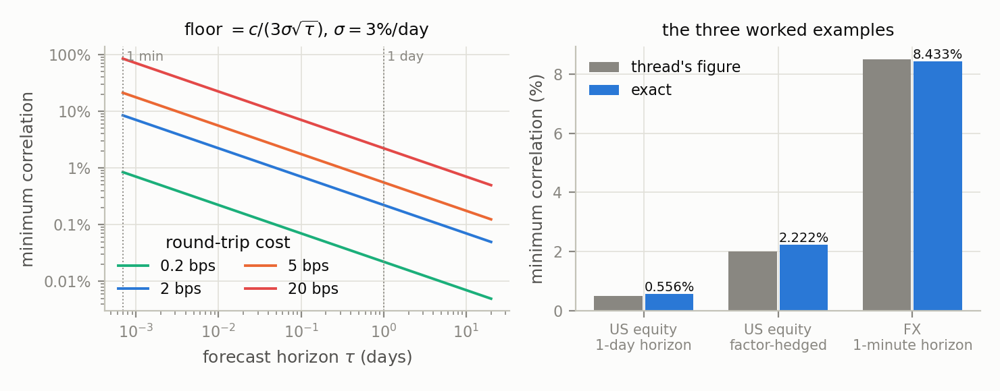

**Figure 1.** The floor as a function of horizon and cost, and the three worked
examples of the source against exact evaluation.

Sections 8 and 9 change the reporting unit. For any calibrated projection of the
return onto the signal, $`R^2`$ equals $`\mathrm{IC}^2`$, so the three floors become
explained-variance scores of 0.0031%, 0.0494% and 0.7111%. Read as a
goodness-of-fit statistic, the first would indicate a model that has learned
nothing. It is not, and the reason is that $`R^2\approx IR^2/BR`$: an $`R^2`$ is
approximately an information ratio squared with the breadth divided out, so it
carries no *economic* interpretation without a breadth beside it. What it does
carry on its own is a predictive mean-squared-error meaning, which is a different
and narrower thing. Being close to a change of metric rather than new
information, it is also not independent evidence for the signal, and honest
evaluation still needs a test set.

Sections 12 to 15 then apply all of it to a market the thread was not written
about, where the horizons are shorter, the costs are structured differently, and
every parameter can be measured instead of assumed.

---

## 1. The source

Frozen verbatim, with all five handwritten images transcribed, in
[`SOURCE.md`](SOURCE.md). Nine tweets, published 2024-06-27. What follows
separates the source's claims from this project's formalisation at every step;
anything not in `SOURCE.md` is this document's addition.

## 2. The model

The thread's model, unchanged. Over a horizon $`\tau`$ measured in days, with a
signal $`x`$ standardised to unit variance,

```math
y=\beta x+\sigma\sqrt{\tau}\,\varepsilon,\qquad
\mathrm{Var}(x)=\mathrm{Var}(\varepsilon)=1,\qquad
\mathrm{Cov}(x,\varepsilon)=0,
```

where $`\sigma`$ is a daily volatility and $`\varepsilon`$ is standard normal.
$`\tau=1`$ is a one-day forecast; $`\tau=1/1440`$ is one minute.

The thread specifies only $`\mathrm{Cov}(x,\varepsilon)=0`$, which is enough
for the variance algebra of Section 3 and for the floor itself, but not for what
follows. Three additions are made explicit here, because uncorrelatedness alone
does not deliver them:

- $`x\sim N(0,1)`$. Assumed from Section 4 onward, wherever a trade frequency, a
  no-trade band or a truncated moment is evaluated. The floor of Section 3 needs
  only second moments; every *frequency* statement needs the distribution.
- $`\mathbb{E}[\varepsilon\mid x]=0`$, strictly stronger than zero covariance.
  Every conditional-expectation and P&L statement uses it. Under zero covariance
  alone the residual may still carry signal in its conditional mean, and the
  band rule's expected payoff would not follow.
- $`\varepsilon\perp x`$ together with $`\mathbb{E}[x^{4}]=3`$. The per-bet Sharpe
  ratio of Section 6 needs the fourth moment, so it is a Gaussian result and not
  a second-moment one.

Where a later result depends on the weaker or the stronger set, the text says so.


**Table 1.** Notation. Symbols taken from the source, and those added by this study.

| Symbol | Meaning | Source or added |
|---|---|---|
| $`x`$ | signal, $`\mathrm{Var}(x)=1`$ | source |
| $`y`$ | return over the next $`\tau`$ days | source |
| $`\beta`$ | signal-to-return sensitivity | source |
| $`\sigma`$ | daily volatility of the residual | source |
| $`\tau`$ | forecast horizon in days | source |
| $`\rho`$ | $`\mathrm{Corr}(x,y)`$ | source |
| $`c`$ | round-trip cost to trade, in return units | source (convention not pinned down) |
| $`\kappa`$ | how many signal standard deviations must fail to pay for the trade | source fixes $`\kappa=3`$ |
| $`k`$ | no-trade band, $`k=c/\beta`$ | **added** |
| $`m`$ | correlation as a multiple of the floor, $`m=\rho/\rho_{\min}`$ | **added** |

The two additions matter because the thread never states a trading rule, and
its two rules of thumb cannot be checked without one.

## 3. Verified derivations

`scripts/check_algebra.py` proves each of these with sympy, either as an exact
identity or by reporting the exact form the thread approximates. Output:
[`results/algebra.json`](results/algebra.json).

**Correlation.** $`\mathrm{Cov}(x,y)=\beta`$ and
$`\mathrm{Var}(y)=\beta^{2}+\sigma^{2}\tau`$, so

```math
\rho=\frac{\beta}{\sqrt{\beta^{2}+\sigma^{2}\tau}}
\qquad\text{exactly},\qquad
\rho\approx\frac{\beta}{\sigma\sqrt{\tau}}
\qquad\text{as the thread writes it.}
```

The thread drops $`\beta^{2}`$ from the variance of $`y`$. Substituting
$`\beta=\rho\sigma\sqrt\tau`$ into the exact expression gives
$`\rho/\sqrt{1+\rho^{2}}=\rho-\rho^{3}/2+O(\rho^{5})`$: a relative error of
$`-\rho^{2}/2`$, which is 0.354% at the largest correlation in the thread and
0.0015% at the smallest. Immaterial. The exact inversion, verified
symbolically, is

```math
\beta=\frac{\rho\,\sigma\sqrt{\tau}}{\sqrt{1-\rho^{2}}}.
```

**The floor.** With $`\kappa\beta\le c`$,

```math
\kappa\rho\,\sigma\sqrt\tau\le c
\quad\Longrightarrow\quad
\rho\le\rho_{\min}=\frac{c}{\kappa\,\sigma\sqrt{\tau}},
```

and the hedging step is exact: doubling $`c`$ while halving $`\sigma`$ multiplies
the floor by exactly $`4`$, which is the thread's 0.5% $`\to`$ 2%.


**Table 2.** The three worked examples: figures stated in the source against exact evaluation.

| Case | Thread | Exact | Relative error |
|---|---:|---:|---:|
| Equity, $`\sigma=3`$%/day, $`c=5`$ bps, $`\tau=1`$ | 0.5% | 0.556% | +11.1% |
| Factor-hedged, $`\sigma=1.5`$%, $`c=10`$ bps | 2% | 2.222% | +11.1% |
| FX, $`\sigma=0.3`$%/day, $`c=0.2`$ bps, $`\tau=1/1440`$ | 8.5% | 8.433% | -0.8% |

The floor scales as $`c/\sqrt\tau`$: shorter horizons make the same alpha harder
to trade, at the rate $`\sqrt\tau`$, which is the whole reason a 0.5%
correlation is respectable in daily equity and worthless in one-minute FX.

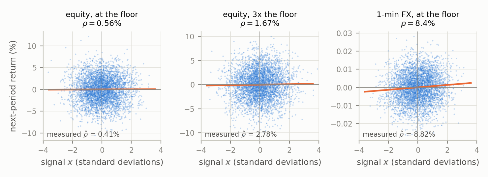

**Figure 3.** Simulated signal and subsequent return at three of these floors,
four thousand observations each. The regression line is the population
relationship; the annotation is the correlation measured on the sample shown.
Nothing in the first panel distinguishes it from noise by inspection, which is
the difficulty the floor exists to resolve.

**Which $`\sigma`$, and why it only matters near $`\rho=1`$.** The model as written
makes $`\sigma`$ the volatility of the *residual*, so
$`\mathrm{Var}(y)=\beta^{2}+\sigma^{2}\tau`$ and the floor above is an
approximation. But the number anyone actually plugs in is a *measured* total
volatility, and under that reading $`\mathrm{Var}(y)=\sigma^{2}\tau`$, so
$`\rho=\beta/(\sigma\sqrt\tau)`$ holds **exactly** and so does the floor.

The two readings agree to $`O(a^{3})`$ where $`a=c/(\kappa\sigma\sqrt\tau)`$, so the
distinction is invisible for every example in the thread and decisive only where
the floor approaches 1. It matters in the applications of Sections 12 and 13,
where short horizons push it past 1, and both are reported there. Applying the
exact residual inversion
$`\kappa\beta\ge c`$ with $`\beta=\rho\sigma\sqrt\tau/\sqrt{1-\rho^{2}}`$ gives

```math
\rho\ \ge\ \frac{a}{\sqrt{1+a^{2}}}\ <\ 1\quad\text{always},
```

verified symbolically, whereas the total-volatility reading gives $`\rho\ge a`$,
which may exceed 1. **Throughout Sections 12 to 15, $`\sigma`$ is measured total volatility.**

**A note on signs.** The floor is a statement about predictive *magnitude*, so the
inequalities are properly written

```math
\kappa|\beta|\le c,\qquad |\rho|_{\min}=\frac{c}{\kappa\sigma\sqrt\tau},
```

and every floor quoted in this report is a bound on $`|\rho|`$. A negatively
correlated signal is not a weaker signal: multiplying it by $`-1`$ leaves an equally
tradable one, and the band rule of Section 4 takes a position in the direction of
$`\beta x`$ whichever sign $`\beta`$ has. Unsigned $`\beta`$ and $`\rho`$ appear below
purely to keep the algebra readable, with $`\beta,\rho>0`$ assumed without loss of
generality. The one place the sign genuinely disappears rather than being
normalised away is $`R^2`$, which is quadratic: Section 8 notes that $`R^2`$ cannot
distinguish an $`\mathrm{IC}`$ of $`+0.2`$ from one of $`-0.2`$, and the loading sign has
to be carried separately.

**Why $`\kappa=3`$ is a convention, and where it hides an assumption.** Nothing
forces $`3`$. What the choice does is import Gaussianity of $`x`$: "three standard
deviations" only means "essentially never" if $`x`$ is normal. The thread assumes
normality of the *return given the signal*, never of the signal. Counterexample
A in §7 is exactly this gap.

## 4. A trading rule, and what it says

The thread compares $`\beta x`$ against $`c`$ but never writes a rule. The
smallest rule consistent with that comparison: each period, forecast
$`\mathbb{E}[y\mid x]=\beta x`$ and take a unit position in its direction if it
covers the round-trip cost, otherwise stay flat. That is a no-trade band
$`|x|\le k`$ with $`k=c/\beta`$ (Constantinides 1986; Davis & Norman 1990).

Two closed forms, both verified symbolically and against 4-million-path Monte
Carlo in `scripts/simulate_bound.py`:

```math
\text{net P\&L per period}=\beta\,\mathbb{E}\bigl[(|x|-k)^{+}\bigr]
=2\beta\bigl[\varphi(k)-k\,Q(k)\bigr],
\qquad
\text{trade frequency}=2Q(k),
```

with $`\varphi`$ the standard normal density and $`Q=1-\Phi`$ the upper tail.

The key structural fact is that **the band depends only on the multiple**:

```math
k=\frac{c}{\beta}=\frac{c}{m\rho_{\min}\sigma\sqrt\tau}=\frac{\kappa}{m}.
```

$`\sigma`$, $`\tau`$ and $`c`$ all cancel. So trade frequency and the fraction of
gross P&L that survives are universal functions of "how many times the floor
is the correlation", so one table serves every market.


**Table 3.** Consequences of exceeding the floor by a given multiple, under the no-trade-band rule.

| $`m`$ | band $`k`$ | trade frequency | net P&L retained | net IR, 500 | gross IR, 500 | net/gross $`IR`$ | $`TC`$ (Clarke) |
|---:|---:|---:|---:|---:|---:|---:|---:|
| $`1.0`$ | $`3.00`$ | 0.27% | 0.10% | $`0.03`$ | $`1.97`$ | 1.47% | 17.06% |
| $`1.5`$ | $`2.00`$ | 4.55% | 2.13% | $`0.24`$ | $`2.96`$ | 7.96% | 50.62% |
| $`2.0`$ | $`1.50`$ | 13.36% | 7.35% | $`0.63`$ | $`3.94`$ | 16.04% | 70.87% |
| $`2.5`$ | $`1.20`$ | 23.01% | 14.06% | $`1.15`$ | $`4.93`$ | 23.39% | 80.96% |
| $`3.0`$ | $`1.00`$ | 31.73% | 20.88% | $`1.75`$ | $`5.92`$ | 29.58% | 85.91% |
| $`5.0`$ | $`0.60`$ | 54.85% | 42.28% | $`4.49`$ | $`9.86`$ | 45.56% | 89.99% |

**Rule of thumb 1 reproduces.** $`1.5\times \Rightarrow k=2 \Rightarrow P(|x|>2)=4.55`$%
against the stated "about 5%".

**Rule of thumb 2 does not.** $`2\times \Rightarrow k=1.5 \Rightarrow P(|x|>1.5)=13.36`$%,
not 20 to 30%. Inverting, 20% needs $`2.34\times`$ and
30% needs $`2.89\times`$. The claim is optimistic by about $`1.2`$ to $`1.4\times`$
in correlation, which at fixed cost and volatility is a real gap: it is the
difference between the "very good" label and something closer to "adequate".

**Three retention numbers, and they are not interchangeable.** Clarke, de Silva &
Thorley (2002) generalised the fundamental law to
$`IR = TC\times IC\times\sqrt{BR}`$, where the transfer coefficient $`TC`$ is defined
as the **correlation between risk-adjusted forecasts and the active weights
actually held**. It measures loss of *alignment* under a constraint and contains
no cost term at all. For the band rule, with forecast $`x`$ and weight
$`h=\mathrm{sign}(x)\mathbf{1}\{|x|>k\}`$,

```math
TC=\mathrm{Corr}(x,h)=\frac{2\varphi(k)}{\sqrt{2Q(k)}},
```

which is the last column. Two nearby quantities are easily mistaken for it: the
P&L column, and the net-over-gross $`IR`$ ratio. Neither is Clarke's, because both
absorb the cost the band exists to avoid.

The three columns say different things and all three are worth reading. At $`m=2`$:

* $`TC=70.9`$%. The band keeps most of the *alignment*, because it never takes a
  position in the wrong direction. What it sacrifices is proportional sizing.
* net/gross $`IR = 16.0`$%. Alignment loss **and** cost drag, risk-adjusted. This
  is net implementation efficiency, not $`TC`$.
* net P&L retained $`=7.35`$%. The same two effects in P&L rather than
  risk-adjusted units, which is harsher because the band cuts P&L and risk in
  different proportions.

The gap between the first and the other two is the point: a high $`TC`$ coexists
with a 7% P&L retention, so a book can be almost perfectly aligned with its
forecast and still keep almost none of its theoretical value. Where this report
says how much of a signal's value cost destroys, it means the P&L column; where it
feeds the fundamental law, it means $`TC`$; where it compares realised against
theoretical performance, it means net/gross $`IR`$.

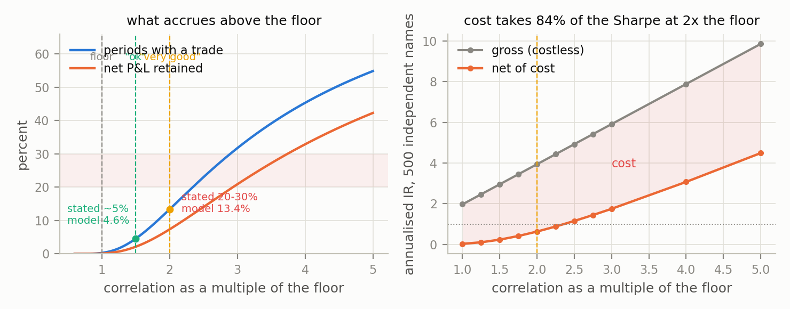

**Figure 2.** Trade frequency and surviving gross P&L above the floor, and the
gross against net information ratio for five hundred independent names.

## 5. The floor is a relevance threshold, not a profitability threshold

Tweet 8 says these are "absolute minimum correlations, you need to exceed these
to be able to trade profitably". Under the thread's own model that is too
strong, and the reason is one line: net P&L is
$`\beta\,\mathbb{E}[(|x|-k)^{+}]`$, which is strictly positive for every
$`\beta>0`$, because a Gaussian $`x`$ exceeds any finite band with positive
probability. Nothing turns negative at the floor.

What happens instead is that the business evaporates:


**Table 4.** Behaviour below the floor: expected net P&L stays positive while trade frequency vanishes.

| $`\rho`$ as a multiple of the floor | $`\rho`$ | band | net P&L / period | trades per year |
|---:|---:|---:|---:|---:|
| $`0.10\times`$ | 0.056% | $`30.0`$ | $`5\times10^{-200}`$ bps | $`\sim0`$ |
| $`0.25\times`$ | 0.139% | $`12.0`$ | $`1\times10^{-34}`$ bps | $`\sim0`$ |
| $`0.50\times`$ | 0.278% | $`6.0`$ | $`3\times10^{-10}`$ bps | $`\sim0`$ |
| $`1.00\times`$ | 0.556% | $`3.0`$ | $`0.0013`$ bps | $`0.7`$ |

Positive, and irrelevant. The floor's real content is that below it a signal
buys fewer than one trade a year per name, retains one part in a thousand of
its gross P&L, and retains 1.5% of its gross information ratio. That last
figure is net implementation efficiency and not Clarke's transfer coefficient,
which Table 3 puts at 17.1% for the same band. That is a better argument than "unprofitable", because it
survives the objection that one could simply wait for bigger signals: one can,
and it does not help.

Where the floor *does* become a genuine profitability threshold is as soon as the
model is left behind, and it is worth being precise about which departures
suffice, because a per-trade cost is not one of them. The cost $`c`$ here is already
fixed and per-trade, and $`\beta\,\mathbb{E}[(|x|-c/\beta)^{+}]>0`$ for every finite
$`c`$: raising $`c`$ widens the band and thins the trade, but never turns the
expectation negative. Listing "any fixed cost per trade" among the departures
would contradict the result in the paragraph above.

Three departures do create a threshold:

* **A charge paid whether or not the signal fires.** A capital charge, a data or
  seat cost, a financing spread on idle collateral. Expected P&L becomes
  $`\beta\,\mathbb{E}[(|x|-k)^{+}]-g`$ for a fixed $`g>0`$, and since the first term
  falls to zero as $`\beta\to0`$ while $`g`$ does not, there is a correlation below
  which the enterprise loses. Note that §13.3's funding is *not* an instance:
  there the carry $`f\tau`$ accrues only while a position is held, so it enters the
  band and §13.3 proves the payoff stays positive. An unconditional $`g`$ is a
  different object.
* **A uniformly bounded conditional edge.** Bounding the *return* alone is not
  enough: a rare bounded event can still pay, and its correlation with the signal
  can be made arbitrarily small, so no correlation threshold follows. What
  suffices is a bound on the conditional expected edge,
  $`\sup_x\,\mathbb{E}[\,|y|\mid x] \le B`$ with $`B<c`$, under which no realisation
  of the signal can cover the cost and expected net P&L is non-positive outright.
  A tick grid does not deliver this: it discretises the price without capping how
  many ticks the price may move.
* **A fixed trading policy.** The band rule may wait arbitrarily long for a large
  reading, and the positivity result is a statement about that freedom. Fix the
  policy instead, by an obligation to quote, a mandate to stay invested, or an
  inventory that must be recycled, and the average trade is drawn from wherever
  the policy places it rather than from the tail the band would have selected.

Each leaves the model rather than refining it, which is the point: the floor as
stated is a relevance criterion, and converting it into a profitability boundary
takes an additional assumption of one of these kinds.

## 6. The bridge to the fundamental law

Tweet 9 promises this extends the law of active management. It does, and the
connection is tighter than the thread says. Take the proportional rule $`h=x`$
with no costs. Then $`\mathbb{E}[hy]=\beta`$ and, using $`\mathbb{E}[x^{4}]=3`$,
$`\mathrm{Var}(hy)=2\beta^{2}+\sigma^{2}\tau`$, so the Sharpe ratio per
period is $`\beta/\sqrt{2\beta^{2}+\sigma^{2}\tau}`$.

Expressing that in correlation units requires the *exact* inversion from
Section 3, $`\beta=\rho\sigma\sqrt{\tau}/\sqrt{1-\rho^{2}}`$, and not the
leading-order one:

```math
\frac{\beta}{\sqrt{2\beta^{2}+\sigma^{2}\tau}}=\frac{\rho}{\sqrt{1+\rho^{2}}}=\rho+O(\rho^{3}).
```

The distinction is not pedantry. Substituting the leading-order inversion $`\beta=\rho\sigma\sqrt{\tau}`$
instead returns $`\rho/\sqrt{1+2\rho^{2}}`$, which is the same mistake Section 3
documents in the thread's correlation formula, committed one section later in
this report's own algebra. The two expressions agree to $`O(\rho^{3})`$, so nothing
in the equity examples moves, but at $`\rho=0.71`$ they differ by 15%. The
quantity $`\rho/\sqrt{1+2\rho^{2}}`$ is not meaningless: it is the same Sharpe
ratio written in terms of the loading-to-noise ratio
$`r=\beta/(\sigma\sqrt{\tau})`$, which equals $`\rho`$ only to leading order. Both
forms are now carried as separate verified identities so that the arguments
cannot be interchanged again.

**The correlation *is* the Sharpe ratio per bet, to leading order in $`\rho`$.**
That is Grinold's (1989) information coefficient, and annualising over $`BR`$
independent bets gives $`IR=IC\sqrt{BR}`$ (Grinold & Kahn 2000, ch. 6). That step
is an idealisation in two ways: it sets the transfer coefficient to one, and it
assumes the bets are independent, which the note on effective sample size in
§12 shows is badly wrong at high frequency. With $`\tau`$-day periods across $`N`$ names, $`BR=252N/\tau`$:


**Table 5.** Annualised information ratio at the floor, by breadth.

| Case | $`\rho`$ at the floor | $`IR`$, 1 name | $`IR`$, 100 | $`IR`$, 500 |
|---|---:|---:|---:|---:|
| Equity, daily | 0.556% | $`0.09`$ | $`0.88`$ | $`1.97`$ |
| Factor-hedged | 2.222% | $`0.35`$ | $`3.53`$ | $`7.88`$ |
| FX, 1-minute | 8.433% | $`50.6`$ | $`506`$ | $`1132`$ |

The FX row is the useful one, because it is obviously false. A costless
fundamental law says a minimum-viable one-minute alpha on a single currency
pair is a Sharpe-50 business. It is not, and the reason is precisely the cost
floor: the same $`\sqrt\tau`$ that inflates $`BR`$ inflates the cost of harvesting
it. The floor and the law are two halves of one statement, and running either
without the other produces implausible figures. Net of the band rule's costs, that
Sharpe-50 collapses: the net column of §4 is the honest one.

The floor also explains a fact the law alone cannot: why a correlation this
small is worth chasing at all. At $`\rho=0.556`$% a single name is hopeless
($`IR=0.09`$). Five hundred names make it a business ($`IR=1.97`$). Breadth is not
a bonus; it is the only reason the number is above the floor of *economic*
relevance rather than merely the floor of arithmetic profitability.

## 7. Where the floor gives the wrong answer

Five counterexamples, in `scripts/counterexamples.py`. Each holds the measured
correlation fixed and changes something the model does not represent. Four are
simulated as well as solved.

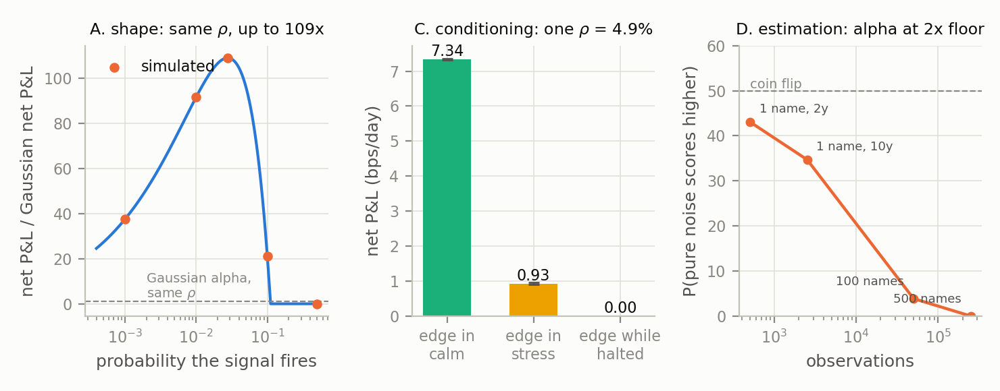

**Figure 4.** Three of the five conditions under which the floor misprices a
signal: signal shape, state-dependent cost, and estimation error.

### A. Shape: correlation cannot see the tails of the signal

Let $`x=0`$ with probability $`1-p`$, and $`\pm1/\sqrt{p}`$ otherwise. Variance is
$`1`$, so the correlation with returns is identical to a Gaussian alpha's.
Tradability is not. Sitting exactly on the floor, where the thread says nothing
works:

```math
\text{net}=p\left(\frac{\beta}{\sqrt p}-c\right)
=\beta\sqrt p-\kappa\beta p,
\qquad\text{maximised at }\sqrt p=\frac{1}{2\kappa},
```

giving $`\beta/(4\kappa)`$ against the Gaussian's
$`\beta\,\mathbb{E}[(|x|-\kappa)^{+}]`$: a ratio of

```math
\frac{1}{4\kappa\,\mathbb{E}\bigl[(|x|-\kappa)^{+}\bigr]}=109\times
\quad\text{at }\kappa=3.
```

At the optimum the signal fires 2.8% of the time and reads exactly
$`6`$ standard deviations when it does. The whole force of "$`3\sigma`$ essentially
never happens" is gone: for this signal, a $`6\sigma`$ reading is the *only* thing
that ever happens. Every earnings-surprise, index-reconstitution and
scheduled-event alpha lives here.

### B. Encoding: the same information scores exactly zero

Let $`\mathbb{E}[y\mid z]=a(z^{2}-1)`$ with $`z`$ standard normal. Then
$`\mathrm{Cov}(z,y)=a\,\mathbb{E}[z^{3}]=0`$, so the Pearson correlation is
exactly zero in population, with nothing hidden and nothing noisy: $`z`$ pins
down the conditional mean completely. Re-encode as $`x=(z^{2}-1)/\sqrt2`$, which
still has unit variance, and the correlation is 1.67%, three times the
floor. Same information, same data, two verdicts. A screen on $`\rho`$ throws
this alpha out at $`t=0`$, and the position built on the raw encoding bleeds
$`-1.6`$ bps a day in pure cost.

The floor is a statement about a (signal, encoding) pair, not about
information. Anything with a U-shaped or threshold response (volatility
signals, distance-to-barrier, crowding measures) arrives in this form by
default.

### C. Conditioning: one correlation, three different businesses

Two equally likely states. Calm: 1% daily volatility, $`3`$ bps to trade.
Stressed: 3% and $`30`$ bps. The pooled floor uses the averages,
$`\bar\sigma=2.236`$% and $`\bar c=16.5`$ bps, giving 2.460%. Build three
alphas at $`\rho=4.919`$%, twice the pooled floor, "very good", differing only
in which state carries the edge:


**Table 6.** Three alphas with identical pooled correlation and different conditional exposure.

| Alpha | measured pooled $`\rho`$ | multiple of its *conditional* floor | net P&L, simulated |
|---|---:|---:|---:|
| edge in the calm state | 4.88% | $`22.0\times`$ | $`7.34 \pm 0.02`$ bps/day |
| edge in the stressed state | 4.93% | $`2.2\times`$ | $`0.93 \pm 0.03`$ bps/day |
| edge only while the name is halted | 4.91% | $`2.2\times`$ | exactly $`0`$ |

A $`7.9\times`$ spread, and a zero, at one pooled correlation (closed forms agree: 7.36, 0.87, $`0`$). Both averages in
the pooled floor are taken over states the alpha does not weight equally, so
the floor prices an alpha nobody holds. The third row is not a contrivance:
alphas whose signal fires precisely when the name is untradable (halts,
auction-only, limit-up) are a standard way for a backtest to be right and
worthless.

### D. Estimation: noise wins a coin flip

The floor states what correlation is required. It says nothing about whether
that correlation can be seen. The asymptotic standard error of a Pearson correlation is
$`(1-\rho^{2})/\sqrt{n-1}`$, so for a real alpha at twice the equity floor
($`\rho=1.111`$%) against pure noise:


**Table 7.** Discriminating a real alpha at twice the floor from pure noise, by sample size.

| Sample | $`n`$ | se | expected $`t`$ | P(noise scores higher) | P(noise measures above the floor) |
|---|---:|---:|---:|---:|---:|
| 1 name, 2 years daily | $`504`$ | 4.46% | $`0.25`$ | 43.1% | 45.1% |
| 1 name, 10 years daily | $`2{,}520`$ | 1.99% | $`0.56`$ | 34.8% | 39.3% |
| 100 names, 2 years | $`50{,}400`$ | 0.45% | $`2.49`$ | 3.8% | 10.6% |
| 500 names, 2 years | $`252{,}000`$ | 0.20% | $`5.58`$ | 0.0% | 0.3% |

And with search, it gets worse. The best of $`M`$ pure-noise candidates has
expected correlation $`\approx\mathrm{se}\sqrt{2\ln M}`$:


**Table 8.** Largest correlation obtained by searching pure noise.

| $`n`$ | candidates searched | best junk $`\hat\rho`$ | as a multiple of the floor |
|---:|---:|---:|---:|
| $`504`$ | $`100`$ | 11.19% | $`20.1\times`$ |
| $`504`$ | $`1{,}000`$ | 14.44% | $`26.0\times`$ |
| $`2{,}520`$ | $`1{,}000`$ | 6.46% | $`11.6\times`$ |
| $`252{,}000`$ | $`1{,}000`$ | 0.65% | $`1.2\times`$ |

On two years of one name, a thousand random candidates reliably produce a
correlation twenty-six times the floor. Anyone using the floor as an acceptance
test on a small sample will accept noise essentially every time. This is the
multiple-testing problem of Harvey, Liu & Zhu (2016) and the deflated Sharpe
ratio of Bailey & López de Prado (2014), arriving through the back door.

The symmetry with §6 is the point worth keeping: the same $`\sqrt{N}`$ that turns
a 0.5% correlation into a Sharpe-2 business is the $`\sqrt{N}`$ that makes it
measurable. Breadth is not only how the edge is harvested; it is how its
existence is established.

### E. Breadth: the law's independence assumption

$`IR=IC\sqrt{BR}`$ needs independent bets. Equicorrelated alphas with pairwise
correlation $`\rho_{\alpha}`$ give

```math
BR_{\text{eff}}=\frac{N}{1+(N-1)\rho_{\alpha}}\;\longrightarrow\;\frac{1}{\rho_{\alpha}},
```

verified symbolically. The limit is the whole story: with 10% correlation
between per-name forecasts, no number of names buys more than ten
independent bets a day.


**Table 9.** Annualised information ratio after alpha correlation, by universe size.

| Names | $`\rho_{\alpha}=0`$ | 2% | 5% | 10% | 30% |
|---:|---:|---:|---:|---:|---:|
| $`100`$ | $`1.76`$ | $`1.02`$ | $`0.72`$ | $`0.53`$ | $`0.32`$ |
| $`500`$ | $`3.94`$ | $`1.19`$ | $`0.77`$ | $`0.55`$ | $`0.32`$ |
| $`2{,}000`$ | $`7.89`$ | $`1.23`$ | $`0.78`$ | $`0.56`$ | $`0.32`$ |

Annualised $`IR`$ at $`\rho=1.111`$%. Going from $`500`$ to $`2{,}000`$ names buys
almost nothing once the alphas are 5% correlated. The thread's closing line
about extending the law points straight at this; it is where the extension
actually bites hardest, because it is multiplicative with everything in §4.

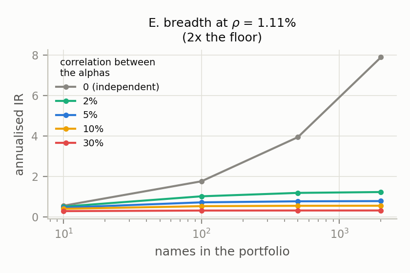

**Figure 5.** Annualised information ratio against universe size for several
levels of correlation between the per-name forecasts.

### F. The one the thread's model has no room for at all: signal decay

$`x`$ is a fresh draw each period, so every trade is a fresh round trip. Real
alphas mean-revert slowly, and a position held across periods amortises its
cost. Give $`x`$ an AR(1) autocorrelation $`\phi`$, charge $`c/2`$ per unit of
position *change*, and gross P&L is untouched: the marginal law of $`x`$ is
still standard normal, while cost falls with turnover:


**Table 10.** Effect of signal persistence on net P&L at twice the floor.

| $`\phi`$ | mean holding periods | turnover | cost | net P&L |
|---:|---:|---:|---:|---:|
| $`0.00`$ | $`1.07`$ | $`0.249`$ | $`0.623`$ bps | $`0.248`$ bps |
| $`0.80`$ | $`2.09`$ | $`0.128`$ | $`0.319`$ bps | $`0.508`$ bps |
| $`0.95`$ | $`4.14`$ | $`0.065`$ | $`0.162`$ bps | $`0.827`$ bps |
| $`0.99`$ | $`9.02`$ | $`0.029`$ | $`0.073`$ bps | $`0.757`$ bps |

At twice the floor, going from an iid signal to $`\phi=0.99`$ multiplies net P&L
by $`3.1\times`$ purely by cutting turnover. (The dip from $`\phi=0.95`$ to $`0.99`$
is noise: the standard error on each net figure is $`0.08`$ bps, so the top two
rows are indistinguishable. The trend across the whole column is not.) So the floor is not a function of
$`(c,\sigma,\tau)`$ alone: it depends on how fast the signal decays, which is
exactly Gârleanu & Pedersen's (2013) result that slower-decaying predictors
deserve more weight when trading is costly. The thread's floor is the
fast-decay limit, and therefore the conservative one.

## 8. Linear regression: the same hurdle in $`R^2`$

For the one-predictor regression of a future return on the signal,

```math
y=\alpha+\beta x+u,
```

ordinary least squares with an intercept gives the population identity

```math
R^2=\mathrm{Corr}(x,y)^2=\mathrm{IC}^2.
```

This is exact, not a small-correlation approximation. It changes the reporting
unit but not the information in the source's one-signal linear model.

The identity is a property of *calibration*, not of the fitting algorithm. It is
commonly attributed to ordinary least squares specifically, which is too narrow,
and Section 9.4 develops why. What it requires is that the prediction be
an orthogonal $`L^{2}`$ projection of the target, so that
$`\mathrm{Cov}(y,\hat y)=\mathrm{Var}(\hat y)`$. Four cases follow, and
they are worth separating because the differences are where practical confusion
lives:

- Same-sample OLS with an intercept satisfies the identity exactly, with one
  predictor or with many, for the fitted values.
- The population conditional mean $`\hat y=\mathbb{E}[y\mid X]`$ satisfies it too,
  by the tower property, *including* when that conditional mean is nonlinear and
  multivariate. A squared-error boosted tree or neural network targets exactly
  this object, so nothing about being nonlinear breaks the identity in
  population.
- OLS evaluated on a *new* sample generally does not satisfy it, because the
  fitted scale is no longer optimal for the new data.
- An arbitrary or miscalibrated prediction satisfies only the inequality
  $`R^2\le\mathrm{IC}^2`$, derived in §9.4.

The three worked floors therefore become:


**Table 11.** The three floors restated as a population $`R^2`$.

| case | IC floor | minimum population $`R^2`$ | variance explained |
|---|---:|---:|---:|
| equity, one day | 0.5556% | $`0.000030864`$ | 0.003086% |
| factor-hedged equity | 2.2222% | $`0.000493827`$ | 0.049383% |
| FX, one minute | 8.4327% | $`0.007111111`$ | 0.711111% |

When $`\sigma`$ is measured **total** return volatility, the exact score hurdle is

```math
R^2_{\min}=\left(\frac{c}{\kappa\sigma\sqrt{\tau}}\right)^2.
```

A value above one means no regression score satisfies the $`\kappa=3`$ criterion
at that horizon. As in Section 5, that is a statement about the criterion and not
an impossibility result: a Gaussian signal retains a positive-expectation tail
whatever the score. When $`\sigma`$ instead denotes the residual
volatility in the literal model, put
$`a=c/(\kappa\sigma\sqrt{\tau})`$; the exact hurdle is

```math
R^2_{\min,\mathrm{residual}}=\frac{a^2}{1+a^2}.
```

Multiples must also be squared:


**Table 12.** The source's rules of thumb expressed in $`R^2`$ units.

| source statement | equivalent $`R^2`$ statement | no-trade band | frequency |
|---|---:|---:|---:|
| at the IC floor | $`1.00\times R^2_{\min}`$ | $`3.0\sigma_x`$ | 0.27% |
| $`1.5\times`$ the IC floor | $`2.25\times R^2_{\min}`$ | $`2.0\sigma_x`$ | 4.55% |
| $`2\times`$ the IC floor | $`4.00\times R^2_{\min}`$ | $`1.5\sigma_x`$ | 13.36% |

For the exact residual-volatility parameterisation, compare
$`R^2/(1-R^2)`$ rather than raw $`R^2`$: the ratio of these odds to the floor odds
is the **squared** loading multiple.

`scripts/r2_regression.py` also fits actual OLS models on one seeded sample and
scores them on a fresh sample:


**Table 13.** Seeded out-of-sample regression: training and test $`R^2`$ against the population value.

| slope case | population $`R^2`$ | training $`R^2`$ | test $`R^2`$ |
|---|---:|---:|---:|
| negative | $`0.040000`$ | $`0.040801`$ | $`0.040631`$ |
| weak | $`0.002500`$ | $`0.002553`$ | $`0.002220`$ |
| strong | $`0.360000`$ | $`0.358987`$ | $`0.360910`$ |

Two safeguards matter. First, $`R^2`$ loses the sign: ICs of $`-0.2`$ and $`+0.2`$
both give $`R^2=0.04`$, so the fitted slope must be retained. Second, the identity
between sample correlation squared and $`R^2`$ is an **in-sample** identity.
Test-set $`R^2`$ should be reported for a predictive claim, and it can be
negative. With multiple predictors, $`R^2`$ is no longer the square of any one
IC; calibration and the scale of predicted returns are then needed to compare
the model with trading cost.

The conclusion is consequently unchanged but more legible for regression:
these are exceptionally small explained-variance hurdles in the daily equity
case, a much larger hurdle at one-minute FX, and still only relevance
thresholds, not guarantees of net profitability.

## 9. What an $`R^2`$ of $`0.00003`$ actually means

§8 establishes the identity: for a one-predictor regression with an intercept,
$`R^2=\mathrm{Corr}(x,y)^2=\mathrm{IC}^2`$ exactly. That converts every floor
in this document into a variance-explained figure, and the figures look
implausibly small:


**Table 14.** Minimum $`R^2`$ implied by each floor, and the variance share it corresponds to.

| case | IC floor | minimum $`R^2`$ | variance explained |
|---|---:|---:|---:|
| equity, one day | 0.5556% | $`3.086e-05`$ | 0.0031% |
| factor-hedged equity | 2.2222% | $`4.938e-04`$ | 0.0494% |
| FX, one minute | 8.4327% | $`7.111e-03`$ | 0.7111% |

Three parts in a hundred thousand. In a field where $`R^2`$ is the conventional
measure of fit, a figure of that size indicates a model that has learned nothing.
The inference is incorrect here, and the reason is worth stating explicitly,
because the misreading discards sound signals.

### 9.1 $`R^2`$ is approximately a Sharpe ratio with the breadth divided out

Substitute the fundamental law $`IR=\mathrm{IC}\sqrt{BR}`$ from §6 into
$`R^2=\mathrm{IC}^2`$:

```math
\boxed{\;R^{2}\approx\frac{IR^{2}}{BR}\;}
```

An $`R^2`$ is approximately an information ratio squared, divided by the number of
independent bets available. **It therefore carries no *economic* interpretation
on its own**: the same $`R^2`$ is a triumph or a disaster depending entirely on a
number that $`R^2`$ does not contain. It does carry a predictive
mean-squared-error meaning on its own, which is why the claim is about economics
specifically and not about emptiness.

The relation is an approximation, and three separate idealisations sit inside it.
$`R^2=\mathrm{IC}^2`$ needs a calibrated projection (§8). $`IR=\mathrm{IC}\sqrt{BR}`$
needs a transfer coefficient of one and independent bets. And the model's own
per-bet Sharpe from §6 is $`\rho/\sqrt{1+\rho^{2}}`$, not $`\rho`$, so under the
proportional rule the exact statement is

```math
\frac{IR^{2}}{BR}=\frac{R^{2}}{1+R^{2}},\qquad\text{equivalently}\qquad
R^{2}=\frac{IR^{2}/BR}{1-IR^{2}/BR}.
```

The gap is $`O(\rho^{4})`$. At the $`R^2`$ values in this section, of order
$`10^{-5}`$ to $`10^{-3}`$, it is invisible, and the boxed form is the one to use.
It becomes material only when $`IR^{2}/BR`$ approaches one, which is to say when
the per-bet Sharpe approaches the ceiling of $`1`$ that the proportional rule
imposes as $`\rho\to1`$. Both forms are verified in `tests/test_engine.py`;
the exact one is `r2_from_ir_exact`.


**Table 15.** One $`R^2`$ read as an information ratio at three breadths.

| $`R^2`$ | $`IR`$ on 1 name, daily | on 100 names | on 500 names |
|---:|---:|---:|---:|
| $`3.09e-05`$ | $`0.09`$ | $`0.88`$ | $`1.97`$ |
| $`4.94e-04`$ | $`0.35`$ | $`3.53`$ | $`7.89`$ |
| $`7.11e-03`$ | $`1.34`$ | $`13.39`$ | $`29.93`$ |

The equity row is the point. An $`R^2`$ of $`3.1\times10^{-5}`$ is an information
ratio of $`0.09`$ on one stock: genuinely worthless, and $`1.97`$ across five
hundred. Same model, same $`R^2`$, and the difference between abandoning the
research and running a Sharpe-2 book is a fact about portfolio construction that
the regression output never sees.

Read the other way, the thread's equity floor is not an arbitrary threshold at
all: **0.556% is approximately the correlation at which a diversified daily
book reaches a Sharpe ratio of 2.** The floor and the target meet there.

### 9.2 Why the number looks so much worse than it is

Two effects compound. First, $`R^2`$ is **quadratic** in the thing that matters, so
it exaggerates every gap. Doubling the IC from 1% to 2%, the difference
between a marginal signal and a good one, moves $`R^2`$ from $`0.0001`$ to $`0.0004`$,
and both round to zero on any ordinary display. Reporting a squared quantity when
the linear one is the economically meaningful one discards resolution precisely
where resolution is required.

Second, the comparison class is wrong. An $`R^2`$ of $`0.9`$ is routine when
predicting a physical process because the signal-to-noise ratio there is high by
construction. Financial returns are close to the opposite limit: they are
mostly unforecastable, which is what it means for a market to be roughly
efficient. The right reference point is not $`1`$ but $`0`$, and the right question is
not what fraction of variance is explained but how many independent bets
this let me place, and what do they cost".

### 9.3 The out-of-sample $`R^2`$ can be negative, and often should be

Because $`R^2`$ is quadratic and tiny, the *estimated* $`R^2`$ on a holdout sample is
dominated by estimation error, and a genuinely positive-IC model can score below
zero out of sample. §9.4 demonstrates it: the `default` and `loose` boosted trees
post $`R^2`$ of $`-0.0020`$ and $`-0.0283`$ while their out-of-sample $`\mathrm{IC}`$
stays positive at +1.80% and +0.36%. The seeded regressions of §8 do *not*
show this, and are not the right citation for it: their three test scores are all
positive, because a calibrated projection has no scale error to pay for.

The distinction those two sections draw is the whole content of the negative
score. A negative $`R^2`$ beside a positive $`\mathrm{IC}`$ indicates miscalibration,
$`a`$ far from $`\mathrm{IC}`$, rather than absent signal. §7D is the same fact in the
IC metric: at these correlations, noise outscores a real alpha 43% of the time
on one name's two-year history.

How much a negative score means depends on its sampling uncertainty, and the sign
alone does not settle it. A materially negative score on a large independent
holdout is strong evidence of a bad forecast or a badly scaled one. A slightly
negative score on a small or serially dependent sample is consistent with noise.
Either way the decomposition of §8, not the sign, is what identifies the cause,
and a standard error from a block bootstrap belongs beside the point estimate.

The practical consequence is a reporting rule rather than a modelling one.

* **Never report an $`R^2`$ for a return model without the breadth beside it.** The
  pair $`(R^2, BR)`$ is interpretable; $`R^2`$ alone is not.
* **Prefer the IC.** It is linear, it is the Sharpe ratio per bet, and it sits in
  the same units as the floor it must clear.
* **Prefer markout P&L to either** for anything execution-sensitive, per §12.
* Treat a near-zero $`R^2`$ as the expected condition of a working alpha, and treat
  a large one as a reason to look for a bug: in the equity case, an $`R^2`$ of
  $`0.01`$ would imply an IC of 10% and, at $`500`$ names, an information ratio of
  $`35`$.

### 9.4 The identity belongs to calibration, not to $`R^2`$

$`R^2=\mathrm{IC}^2`$ is a property of a calibrated projection rather than of the
coefficient of determination. What breaks it is miscalibration of the predicted
*scale*, not the choice of learner. A gradient-boosted tree, a neural network, or
an OLS fit whose predictions are subsequently rescaled will all break it in a
finite sample, and a boosted tree that recovered the population conditional mean
would satisfy it. Let

```math
a=\frac{\mathrm{sd}(\hat y)}{\mathrm{sd}(y)},
\qquad
b=\frac{\mathrm{mean}(\hat y)-\mathrm{mean}(y)}{\mathrm{sd}(y)}
```

denote the scale and the bias of a forecast. For an arbitrary $`\hat y`$ the exact
out-of-sample identity is

```math
R^{2}=2\,\mathrm{IC}\,a-a^{2}-b^{2}
=\mathrm{IC}^{2}-(a-\mathrm{IC})^{2}-b^{2},
```

which is verified symbolically and against simulation in `scripts/gbm_r2.py`. The
second form carries the content. It states that

```math
R^{2}\le\mathrm{IC}^{2}\quad\text{always},
```

with equality if and only if $`a=\mathrm{IC}`$ and $`b=0`$. Since
$`a=\mathrm{sd}(\hat y)/\mathrm{sd}(y)\ge0`$ by construction, that condition
presumes the forecast has been oriented so that $`\mathrm{IC}\ge0`$; for a
sign-flipped forecast the attainable maximum is $`R^{2}\le0`$ and the fix is to
negate the prediction rather than to rescale it. Least squares with an
intercept satisfies both conditions by construction on the sample it was fitted
to, which is the entire reason the equality appears in Section 8. So does the
population conditional mean, nonlinear or otherwise. What an unconstrained
learner lacks is not linearity but the guarantee: in a finite sample, under
regularisation, misspecification or distribution shift, its realised test
predictions satisfy the conditions only by accident. The failure mode below is
therefore a statement about finite-sample calibration, and the shrinkage pattern
in Table 16 is the visible form of it.

Two corollaries follow. First, $`\mathrm{IC}^2`$ is a **ceiling** on the
attainable out-of-sample $`R^2`$, so the floors of Section 8 remain valid as
necessary conditions on $`\mathrm{IC}`$, and an observed $`R^2`$ above
$`\rho_{\min}^2`$ is sufficient but not necessary evidence that the floor has been
cleared. Second, the $`R^2`$-optimal scale is $`a=\mathrm{IC}`$, which prescribes
severe shrinkage: a forecast of a return whose information coefficient is 3%
should carry three percent of the target's standard deviation, not all of it. A
raw regression output scaled to match the target is over-scaled by a factor
$`1/\mathrm{IC}`$.

The behaviour is visible in a gradient-boosted tree trained on synthetic features
whose achievable information coefficient is known. Data are ordered in time and
split into three consecutive blocks, and the rescaling below is calibrated on the
middle block alone:


**Table 16.** Gradient-boosted tree: information, realised $`R^2`$, and $`R^2`$ after affine rescaling.

| regularisation | out-of-sample $`\mathrm{IC}`$ | $`\mathrm{IC}^2`$ | out-of-sample $`R^2`$ | scale $`a`$ | $`R^2`$ after rescaling |
|---|---:|---:|---:|---:|---:|
| very shrunk | +3.105% | $`0.000964`$ | $`+0.000738`$ | $`0.0160`$ | $`+0.000923`$ |
| shrunk | +2.802% | $`0.000785`$ | $`+0.000715`$ | $`0.0364`$ | $`+0.000777`$ |
| default | +1.800% | $`0.000324`$ | $`-0.001961`$ | $`0.0658`$ | $`+0.000320`$ |
| loose | +0.360% | $`0.000013`$ | $`-0.028300`$ | $`0.1719`$ | $`+0.000010`$ |
| overfit | -0.249% | $`0.000006`$ | $`-0.098665`$ | $`0.3116`$ | $`-0.000165`$ |

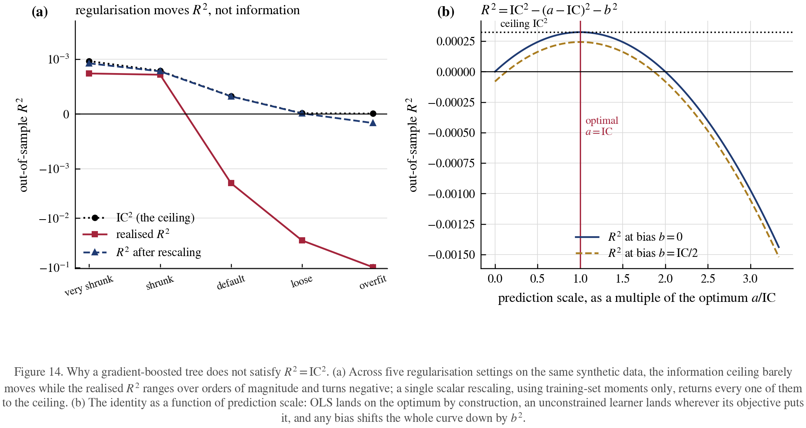

At the default setting the tree attains an information coefficient of
1.80%, an unambiguously positive signal, and an out-of-sample
$`R^2`$ of $`-0.001961`$, which is negative. The decomposition attributes
100% of
the shortfall to scale error: the predictions carry
6.6% of the target's standard deviation where
1.8% is optimal, an over-scaling of
$`3.7`$ times. Overfitting degrades both
quantities, as it must, but it degrades $`R^2`$ by an order of magnitude more,
because scale error enters quadratically and is not bounded.

The practical consequence is that a squared-error objective and an
information-coefficient objective are not the same objective, and that reporting
$`R^2`$ for a tree ensemble without its scale conflates two failures. A rank
correlation is a further step removed: Spearman $`\mathrm{IC}`$ was
1.77% against Pearson 1.80% here,
and no identity connects its square to $`R^2`$ at all, because the $`R^2`$ relation is
a statement about second moments and a rank transform discards the magnitudes
those moments are computed from.

### 9.5 Reading an out-of-sample $`R^2`$

One definition has to be fixed before the bands mean anything, because two
different statistics travel under the name "out-of-sample $`R^2`$". Every table in
this report uses the standard sample coefficient of determination on held-out
data,

```math
R^{2}=1-\frac{\sum_{t}(y_{t}-\hat y_{t})^{2}}
                {\sum_{t}(y_{t}-\bar y_{\text{test}})^{2}},
```

whose denominator centres on the realised test-sample mean. That mean was not
knowable when the forecasts were made, so this quantity is a descriptive fit
measure, not a statement about a feasible competing forecast. The forecasting
literature more often reports

```math
R^{2}_{\text{OOS}}=1-\frac{\sum_{t}(y_{t}-\hat y_{t})^{2}}
                            {\sum_{t}(y_{t}-\hat y^{\text{bench}}_{t})^{2}},
```

against a benchmark built only from information available at $`t`$, usually a zero
or expanding-mean forecast. The two differ by how the denominator is centred, and
they can straddle zero differently on the same predictions. The $`\mathrm{IC}`$,
scale and bias decomposition of §8 is derived for the first definition and does
not transfer unchanged to an arbitrary feasible benchmark. Where a return has
mean near zero relative to its volatility, which covers every case in this
report, the two nearly coincide.

Combining the ceiling with $`R^2\approx IR^2/BR`$ gives the following scale for
return prediction. The bands are one-signal, one-horizon figures and assume the
target is a future return rather than an overlapping or contemporaneous quantity.

Two conventions govern how the table reads $`R^2`$ back into $`\mathrm{IC}`$.
Section 8 proves $`R^2\le\mathrm{IC}^2`$ for an arbitrary prediction, so inverting
it gives $`\mathrm{IC}\ge\sqrt{R^2}`$: a *lower* bound, attained with equality only
by a calibrated projection. The bands below are therefore stated as
$`\mathrm{IC}\ge`$, and a miscalibrated model with the same $`R^2`$ has a higher
$`\mathrm{IC}`$ than the band names. Reading the equality into a boosted-tree or
otherwise uncalibrated score understates its correlation.

**Table 17.** Interpretation bands for an out-of-sample $`R^2`$ on a future return. The $`\mathrm{IC}`$ column is a lower bound, exact for a calibrated projection.

| out-of-sample $`R^2`$ | interpretation |
|---|---|
| $`R^2<0`$ | the forecast loses to the realised test-sample mean, the denominator fixed above. Routine for a return model and not by itself disqualifying: decompose before discarding, because $`a`$ alone can produce it |
| $`R^2=0`$ | exactly as good as the realised test-sample mean. Not the same as tying a feasible zero or historical-mean benchmark, which is the $`R^2_{\mathrm{OOS}}`$ of the second definition above |
| $`10^{-5}`$ to $`10^{-4}`$ | $`\mathrm{IC}\ge0.3`$% to 1%. Straddles the daily equity floor rather than clearing it: the calibrated threshold is $`3.09\times10^{-5}`$, so the lower half of this band is *below* the floor and the upper half above it. For a miscalibrated forecast the bound is one-sided, so compare the $`\mathrm{IC}`$ with the floor directly |
| $`10^{-3}`$ | $`\mathrm{IC}\ge3`$%. Strong for a daily horizon |
| $`10^{-2}`$ | $`\mathrm{IC}\ge10`$%. Exceptional at a daily horizon; at $`500`$ names it implies $`IR\approx35`$, which is a reason to audit the pipeline |
| $`>0.05`$ | $`\mathrm{IC}\ge22`$%. Credible only at the shortest horizons, and then only for a maker. At a daily horizon the same figure implies $`IR\approx4`$ on a single name. Grounds for auditing the pipeline for lookahead, leakage, or an overlapping target, though not by itself a proof of any of them |

The bands above are not horizon-free, and the omission matters. What scales
mechanically with horizon is the *cost floor*, as $`c/(\kappa\sigma\sqrt\tau)`$;
attainable $`\mathrm{IC}`$ does not. Its horizon dependence is a property of the
particular signal, since a signal decays at its own rate, and it can rise, fall
or stay flat as the horizon shortens. The reason short-horizon $`\mathrm{IC}`$s are
empirically larger is that microstructure signals forecast a bounded imminent
move whose size does not grow with $`\tau`$ while the return's noise grows as
$`\sqrt\tau`$; that is an observation about a signal family, not an identity. What
*is* horizon-mechanical is the translation from $`\mathrm{IC}`$ into an information
ratio. Two cautions belong *before* the table rather than after it.

First, the table evaluates the exact proportional-rule result of §6,

```math
IR=\sqrt{\frac{R^{2}}{1+R^{2}}}\;\sqrt{BR},
```

and not the approximation $`IR=\sqrt{R^{2}BR}`$ used elsewhere in this section. At
$`R^{2}=0.05`$ over $`365`$ daily bets the two give $`4.17`$ and $`4.27`$; the exact form
is the one tabulated. Second, $`BR=1/\tau`$ counts every non-overlapping period as
an independent bet with a stable per-bet $`\mathrm{IC}`$, which at short horizons
is false in the direction that flatters: forward returns sampled faster than the
horizon overlap and signals persist, so the effective count can fall orders of
magnitude below the nominal one. The table is therefore an **iid,
non-overlapping benchmark**, useful for showing that a fixed $`R^{2}`$ means
different things at different horizons, and not a Sharpe ratio any book would
earn.

**Table 18.** Annualised information ratio implied by $`R^{2}=0.05`$, i.e. $`\mathrm{IC}=22.36`$%, by horizon, on one instrument, at $`365`$ bets per day-equivalent year. Exact proportional-rule formula; iid and non-overlapping.

| horizon | implied $`IR`$ |
|---|---:|
| 1 day | $`4.17`$ |
| 1 minute | $`158`$ |
| 10 seconds | $`388`$ |
| 1 second | $`1225`$ |

so the same $`R^2`$ is merely strong at a daily horizon and economically implausible
below a minute. Implausible, not impossible: the bound being violated is what a
market will supply, not what arithmetic permits. Any threshold for "too good" must therefore be quoted
against a horizon. A useful reformulation: convert the $`R^2`$ to an implied
information ratio through $`IR=\sqrt{R^{2}\,BR}`$ and judge that, because an
information ratio is comparable across horizons in a way that $`R^2`$ is not. An
implied $`IR`$ above roughly $`10`$ on a single instrument is a defect report, not a
result.

The effective-sample note in §12 develops why the nominal bet count overstates
the independent one at high frequency, which is the same caution stated before
the table above.

Three reporting rules follow, and they are rules about accompanying information
rather than about modelling.

* An $`R^2`$ for a return model is economically uninterpretable without the
  breadth, because $`R^2\approx IR^2/BR`$. The pair $`(R^2,BR)`$ carries the
  economics; $`R^2`$ alone carries only mean-squared error.
* An $`R^2`$ for a non-OLS predictor is uninterpretable without the scale $`a`$,
  because $`\mathrm{IC}^2-R^2=(a-\mathrm{IC})^2+b^2`$ and a single number cannot
  distinguish a weak signal from a mis-scaled one.
* $`\mathrm{IC}`$ is preferable to $`R^2`$ for both purposes. It is linear rather
  than quadratic, it is invariant to the scaling that $`R^2`$ penalises, and to
  leading order it is the Sharpe ratio per bet, which places it in the same units
  as the floor it must clear.

## 10. What survives


**Table 19.** Verdict on each claim of the source.

| Claim | Verdict |
|---|---|
| $`\rho_{\min}=c/(3\sigma\sqrt\tau)`$, and its $`\sqrt\tau`$ scaling | **Holds.** The single most useful sentence on the subject. |
| $`\beta=\rho\sigma\sqrt\tau`$; $`\rho`$ is the per-bet Sharpe | **Holds** to $`O(\rho^{3})`$. |
| The three worked numbers | **Reproduce** to one significant figure. |
| $`1.5\times\Rightarrow`$ trade $`\sim5`$% of periods | **Reproduces** (4.55%). |
| $`2\times\Rightarrow`$ trade $`20`$ to 30% | **Fails.** 13.4%; needs $`2.34`$ to $`2.89\times`$. |
| "Must exceed to trade profitably" | **Too strong.** It is a relevance threshold: positive but negligible below. |
| Extends the law of active management | **Holds**, and is needed: the costless law gives $`IR=50`$ for a minimum-viable FX alpha. |
| The floor is a property of $`(c,\sigma,\tau)`$ | **Incomplete.** Also of the signal's distribution, its encoding, its conditional states, and its decay rate. |

The thread is a good piece of applied reasoning that gets the hard part right
and is quietly conditional on Gaussianity in three places. Used as an
order-of-magnitude sanity check, the job it was written for, it works. Used
as an acceptance test on a research pipeline, it will let through noise
(counterexample D) and reject real alphas (A and B).

## 11. References

**The source**

- The thread under study, published 2024-06-27 by the account
  `@macrocephalopod`, nine posts with five attached images of handwritten
  derivations:
  <https://x.com/macrocephalopod/status/1806436278067470524>. Transcribed in full,
  including the images, in [`SOURCE.md`](SOURCE.md), which also records the
  retrieval method and separates what the source states from what it does not.

The floor itself does not appear in the published literature in this form. Every
component it is assembled from does.

**The law it extends**

- Grinold, R. C. (1989). "The Fundamental Law of Active Management."
  *Journal of Portfolio Management* 15(3), 30-37. The origin of
  $`IR=IC\sqrt{BR}`$ and of reading a signal's correlation as a Sharpe ratio.
- Grinold, R. C. & Kahn, R. N. (2000). *Active Portfolio Management*, 2nd ed.
  McGraw-Hill. Ch. 6 for the law, ch. 16 for turnover and cost.
- Clarke, R., de Silva, H. & Thorley, S. (2002). "Portfolio Constraints and the
  Fundamental Law of Active Management." *Financial Analysts Journal* 58(5),
  48-66. The transfer coefficient, $`IR=TC\cdot IC\sqrt{BR}`$: the last column
  of §4's Table 3, and the reason it differs from the P&L column beside it.
- Buckle, D. (2004). "How to calculate breadth: an evolution of the fundamental
  law of active portfolio management." *Journal of Asset Management* 4,
  393-405. Effective breadth under correlated bets (§7E).
- Qian, E., Hua, R. & Sorensen, E. (2007). *Quantitative Equity Portfolio
  Management*. Chapman & Hall. Strategy risk and the law's failure modes.

**Costs, bands and optimal trading**

- Constantinides, G. M. (1986). "Capital Market Equilibrium with Transaction
  Costs." *Journal of Political Economy* 94(4), 842-862. No-trade bands.
- Davis, M. H. A. & Norman, A. R. (1990). "Portfolio Selection with Transaction
  Costs." *Mathematics of Operations Research* 15(4), 676-713. The optimal
  no-trade region: the rule in §4 is a crude one-period version.
- Gârleanu, N. & Pedersen, L. H. (2013). "Dynamic Trading with Predictable
  Returns and Transaction Costs." *Journal of Finance* 68(6), 2309-2340.
  Aim in front of the target; slower-decaying signals get more weight. Directly
  the content of §7F.
- Almgren, R. & Chriss, N. (2001). "Optimal Execution of Portfolio
  Transactions." *Journal of Risk* 3(2), 5-39.
- Almgren, R., Thum, C., Hauptmann, E. & Li, H. (2005). "Direct Estimation of
  Equity Market Impact." *Risk* 18(7), 58-62. Cost is not the constant $`c`$ the
  floor assumes; it grows with size, so the floor is a floor per unit of
  capital.
- Kyle, A. S. (1985). "Continuous Auctions and Insider Trading."
  *Econometrica* 53(6), 1315-1335.
- Novy-Marx, R. & Velikov, M. (2016). "A Taxonomy of Anomalies and Their
  Trading Costs." *Review of Financial Studies* 29(1), 104-147. The empirical
  version of this thread: which published anomalies survive costs.

**Measuring the correlation**

- Harvey, C. R., Liu, Y. & Zhu, H. (2016). "...and the Cross-Section of Expected
  Returns." *Review of Financial Studies* 29(1), 5-68. Multiple testing; why
  §7D's search table is the normal case, not the pathological one.
- Bailey, D. H. & López de Prado, M. (2014). "The Deflated Sharpe Ratio:
  Correcting for Selection Bias, Backtest Overfitting, and Non-Normality."
  *Journal of Portfolio Management* 40(5), 94-107.
- Lo, A. W. (2002). "The Statistics of Sharpe Ratios." *Financial Analysts
  Journal* 58(4), 36-52. Why $`\sqrt{252/\tau}`$ annualisation breaks when
  returns autocorrelate: relevant to §7F.
- Kendall, M. G. & Stuart, A. (1977). *The Advanced Theory of Statistics*,
  vol. 1, 4th ed. Griffin. The $`(1-\rho^{2})/\sqrt{n-1}`$ standard error, from
  Fisher's work on the correlation coefficient.

**Practitioner treatments of signal strength**

- Isichenko, M. (2021). *Quantitative Portfolio Management: The Art and Science
  of Statistical Arbitrage*. Wiley. Ch. 3-4 on realistic IC magnitudes by
  horizon, and on cost as the binding constraint.
- Paleologo, G. A. (2021). *Advanced Portfolio Management: A Quant's Guide for
  Fundamental Investors*. Wiley. Factor hedging and its cost, which is tweet
  6/9's step.
- Cartea, Á., Jaimungal, S. & Penalva, J. (2015). *Algorithmic and
  High-Frequency Trading*. Cambridge University Press. The short-$`\tau`$ end,
  where the floor is 8.4% rather than 0.6%.
- Kakushadze, Z. (2016). "101 Formulaic Alphas." *Wilmott* 2016(84), 72-81.
  Why $`\rho_{\alpha}`$ in §7E is not small in practice.

## 12. Application: a market the thread was not written about

`scripts/crypto_market_making.py`. The floor prices the cost of *crossing* a
spread, so it applies to a taker unchanged and does not apply to a maker at all.
A market maker is paid the spread rather than paying it; what bounds them instead
is granularity, because a quote cannot be skewed by less than one tick. Replacing
$`c`$ with the tick size gives the same algebra and a bar between one and three
orders of magnitude lower. That substitution is not the thread's, and it is
a necessary condition only: see the caveats below.

Defaults below are order-of-magnitude figures for Binance USDT-margined perps in
a normal regime. Volatility and tick are the 2026 measurements of §15
($`\sigma`$ = 2.50%/day BTC, 3.36% ETH, 5.19% alt; ticks 0.0151, 0.0517 and 1.28
bps), taker 1.7 bps at top tier and 5 bps retail; the spread remains an
assumption, floored at one tick for the majors. They are inputs to be replaced
with venue figures, not facts.

**Taking.** Minimum IC to clear a round trip, top fee tier.

Every sub-minute row in this section and the next is a **Brownian-scaling thought
experiment, not a measurement.** The volatilities are daily figures extrapolated by
$`\sigma(\tau)=\sigma_{\text{daily}}\sqrt\tau`$ down to $`100`$ milliseconds, and that
extrapolation is not a consequence of the daily or minute data it rests on. Below
roughly a minute, price discreteness, runs of exactly zero returns, bid-ask bounce,
the difference between event time and clock time, and the volatility-signature
effect all bite, and they do not all push the same way: bounce inflates measured
variance at short horizons while zero returns deflate it. Establishing these
figures as market facts requires trade, midquote or BBO data at the sampling
interval in question, which the archive behind §15 does not contain. The rows are
kept because the *scaling* argument, that cost is fixed while opportunity grows as
$`\sqrt\tau`$, is what carries the conclusion, and it survives a considerable error
in the level.

The horizon-inversion tables further hold the IC fixed while varying $`\tau`$. That
is a counterfactual, not a forecast: a real signal's IC changes with horizon
because signals decay. Read every "minimum horizon" figure as conditional on an IC
that does not move with $`\tau`$, and note that the condition is usually false in the
direction that hurts, since a signal held longer than its decay scale has a lower
IC than the one quoted.


**Table 20.** Minimum time-series IC to clear a round trip, top fee tier. Sub-minute rows are Brownian extrapolations.

| horizon | BTC perp | ETH perp | mid-cap alt |
|---|---:|---:|---:|
| 100 ms | $`\kappa=3`$ unsatisfiable | $`\kappa=3`$ unsatisfiable | $`\kappa=3`$ unsatisfiable |
| 1 s | $`\kappa=3`$ unsatisfiable | $`\kappa=3`$ unsatisfiable | $`\kappa=3`$ unsatisfiable |
| 10 s | 42.33% | 31.83% | 38.21% |
| 1 min | 17.28% | 12.99% | 15.60% |
| 5 min | 7.73% | 5.81% | 6.98% |
| 1 h | 2.23% | 1.68% | 2.01% |

**Making.** Minimum IC for the forecast to move a quote by one tick at all:


**Table 21.** Minimum IC for a forecast to move a quote by one tick.

| horizon | BTC perp | ETH perp | mid-cap alt |
|---|---:|---:|---:|
| 100 ms | 1.871% | 4.767% | 76.415% |
| 1 s | 0.592% | 1.508% | 24.165% |
| 10 s | 0.187% | 0.477% | 7.641% |
| 1 min | 0.076% | 0.195% | 3.120% |
| 5 min | 0.034% | 0.087% | 1.395% |
| 1 h | 0.010% | 0.025% | 0.403% |

At one second the two differ by a factor of $`226`$ on BTC. The taker floor there
reads 134%, which is not a correlation, and the reason is worth stating
without reference to correlation at all. **A three-sigma one-second BTC move is
$`2.55`$ bps and the round trip costs $`3.42`$ bps.** No correlation, however high,
makes a $`\kappa=3`$ reading of the signal pay for the trade it implies. That is
what "unsatisfiable" means in the tables of this section: the $`\kappa=3`$ relevance
criterion cannot be satisfied at any correlation. It is a fact about the market
rather than about the forecast.

It is *not* a claim that trading is unprofitable there. Section 5 established
why: under the
Gaussian model a no-trade band has strictly positive expected net payoff for any
$`\beta>0`$, because the signal eventually prints a large enough reading. That
argument does not stop applying when the floor crosses unity. With
$`a=c/(\kappa\sigma\sqrt\tau)=1.338`$ for BTC at one second, the break-even band in
signal units is $`k=c/\beta=\kappa a=4.015`$ under perfect foresight, and

```math
P(|x|>k)=5.96\times10^{-5},
```

so a perfectly informed trader still has a positive-expectation trade available
about once every $`16{,}800`$ seconds, or $`4.7`$ hours. The same calculation gives
one per $`3{,}500`$ seconds for the mid-cap case and one per $`400`$ seconds for
ETH, whose floor now sits just above unity at 100.65%. These are economically negligible and
they are not zero, and the distinction matters because it is the difference
between a statement about relevance and a statement about arithmetic
impossibility. Only the former is established here.

A genuine impossibility result is available, but it needs an assumption this
model does not make: a bounded return, a hard tick-level cap on the move, or a
constraint that forces trading at a fixed frequency rather than waiting for the
tail. §5 names the last of these as the point where the floor does become a
genuine profitability threshold, and it is the one that binds in practice.


**Table 22.** The two readings of $`\sigma`$ where the floor approaches unity.

| instrument | horizon | $`3\sigma`$ move | round trip | floor, total vol | floor, residual vol | $`\kappa=3`$ criterion |
|---|---|---:|---:|---:|---:|---|
| BTCUSDT | 1 s | $`2.55`$ bps | $`3.42`$ bps | 133.84% | 80.11% | **unsatisfiable** |
| BTCUSDT | 10 s | $`8.07`$ bps | $`3.42`$ bps | 42.33% | 38.98% | satisfiable |
| BTCUSDT | 1 min | $`19.76`$ bps | $`3.42`$ bps | 17.28% | 17.03% | satisfiable |
| ETHUSDT | 1 s | $`3.43`$ bps | $`3.45`$ bps | 100.65% | 70.94% | **unsatisfiable** |
| ETHUSDT | 10 s | $`10.84`$ bps | $`3.45`$ bps | 31.83% | 30.33% | satisfiable |
| ETHUSDT | 1 min | $`26.56`$ bps | $`3.45`$ bps | 12.99% | 12.89% | satisfiable |
| mid-cap | 1 s | $`5.30`$ bps | $`6.40`$ bps | 120.82% | 77.04% | **unsatisfiable** |
| mid-cap | 10 s | $`16.75`$ bps | $`6.40`$ bps | 38.21% | 35.69% | satisfiable |
| mid-cap | 1 min | $`41.03`$ bps | $`6.40`$ bps | 15.60% | 15.41% | satisfiable |

The last two columns are the two readings of $`\sigma`$ from §3. Under measured
total volatility the floor is exact and may exceed 1, which is the case marked
unsatisfiable, meaning no correlation satisfies the $`\kappa=3`$ criterion. Under the
thread's literal residual-volatility model the exact floor is
$`a/\sqrt{{1+a^{{2}}}}`$, always below 1: BTC at one second reads 80% rather
than 134%, but only because that reading lets total volatility inflate to
$`\sigma/\sqrt{{1-\rho^{{2}}}}=4.17`$%/day, contradicting the 2.5% that was
measured and fed in. Either way the cell fails the relevance criterion; only the
first reading says so in one step.

For any signal whose life is measured in seconds, passive execution is therefore
not an optimisation, it is the entire strategy.

**The binding constraint is horizon, not IC.** Shortest holding period at which a
given IC pays for itself, BTC perp:


**Table 23.** Shortest holding period at which a given IC pays for itself.

| style | round-trip cost | IC 3% | IC 10% | IC 20% |
|---|---:|---:|---:|---:|
| cross in, cross out, retail fees | 10.02 bps | 4.8 h | 26 min | 6 min |
| cross in, cross out, top tier | 3.42 bps | 33 min | 3 min | 45 s |
| post to enter, cross to exit | 1.71 bps | 8 min | 45 s | 11 s |
| post both sides, fee rebate | 0.00 bps | any | any | any |
| quote skew only (one tick) | 0.02 bps | 39 ms | 4 ms | 1 ms |

**What will actually decide it, none of which is in the model.** One tick on
BTCUSDT perp is about $`0.0151`$ bps while the retail maker fee is $`2`$ bps per
side: one fee is $`132\times`$ the tick, and a two-sided round trip is
$`264\times`$ it. Passive making on majors is a fee-tier
problem before it is a research problem. Once maker fees reach zero or below, the
economics per round trip at a one-second holding period are roughly $`1.0`$ bps of
revenue (two half-spreads plus rebate) against an unconditional one-second move
of $`0.85`$ bps, so the whole game is keeping
$`\mathbb{E}[\text{move} \mid \text{filled}]`$ under a basis point. The
metric that measures that is markout P&L at the real holding horizon conditional
on fills, not an unconditional IC. Beyond it: queue position (§7 has no notion of
it), latency as an IC multiplier, funding as a carry on inventory, and the fact
that the floor *falls* when volatility spikes: exactly when spreads widen and
flow turns toxic, which is counterexample C.

Two things do go crypto's way. High volatility lowers the floor, which is
proportional to $`1/\sigma`$: BTC at 2.5%/day against the thread's FX example at
0.3%/day is an eightfold lower bar at the same cost. And estimation is
tractable in a way equities are not: a 0.4% IC at a one-second horizon needs
$`562{,}000`$ observations, which is $`6.5`$ days on a single symbol, against the
$`1{,}157`$ asset-years the equity equivalent demanded in §7D.

Every observation count in this report, here and in Tables 9 and 33, is an
**independent-sampling lower bound** and should be read as one. The formulas
behind them assume non-overlapping draws and a stable correlation, and
high-frequency data satisfies neither: returns and signals are autocorrelated, a
multi-period target overlaps its neighbours, and names are cross-correlated. The
gap is not a rounding matter. A one-second target sampled every book event, at a
few hundred events per second, shares each forward return across every sample
inside the horizon, so the effective count can be two orders of magnitude below
the raw one. $`562{,}000`$ one-second observations are $`562{,}000`$ *rows*, not
$`562{,}000`$ independent bets, and the honest reading is that $`6.5`$ days is the
floor of what is required rather than an estimate of it. Where a claim rests on a
count, an effective sample size or a block-bootstrap interval belongs beside it.

## 13. The retail case: Binance VIP 0

`scripts/vip0_fee_analysis.py`. VIP 0, **taker 0.0500%, maker 0.0200%**, is
the tier almost every retail account actually trades on, and it changes the
conclusion qualitatively rather than quantitatively. Round trips on BTCUSDT perp,
in basis points:


**Table 24.** Round-trip cost by execution style and fee tier.

| execution | VIP 0 | VIP 0 with BNB | VIP 9 |
|---|---:|---:|---:|
| cross in, cross out | $`10.02`$ | $`9.02`$ | $`3.4151`$ |
| post in, cross out | $`7.01`$ | $`6.31`$ | $`1.7075`$ |
| quote both sides | $`3.98`$ | $`3.58`$ | $`-0.0151`$ |

### 13.1 The retail wedge is quadratic in horizon

VIP 0 costs $`2.93\times`$ the round trip of the top tier. Because
$`\rho_{\min}\propto c/\sqrt\tau`$, that is $`2.93\times`$ the correlation at a
fixed horizon but $`8.6\times`$ the **horizon** at a fixed correlation. Fees do
not require a better signal; they require holding it nine times longer.

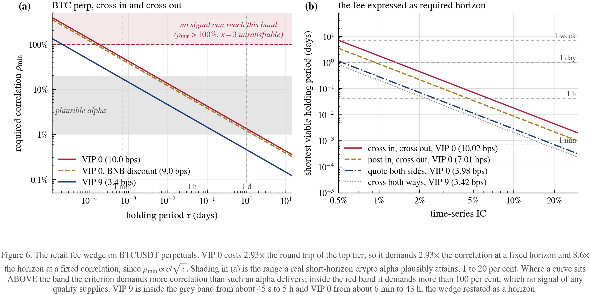

Minimum IC to clear a round trip, crossing both ways at VIP 0:


**Table 25.** Minimum IC at the retail tier, crossing in both directions.

| horizon | BTC perp | ETH perp | mid-cap alt |
|---|---:|---:|---:|
| 10 s | $`\kappa=3`$ unsatisfiable | 92.69% | 77.61% |
| 1 min | 50.67% | 37.84% | 31.68% |
| 5 min | 22.66% | 16.92% | 14.17% |
| 30 min | 9.25% | 6.91% | 5.78% |
| 1 h | 6.54% | 4.89% | 4.09% |
| 4 h | 3.27% | 2.44% | 2.05% |
| 1 day | 1.34% | 1.00% | 0.83% |
| 3 days | 0.77% | 0.58% | 0.48% |
| 1 week | 0.50% | 0.38% | 0.32% |

And inverted: the shortest horizon at which a given IC pays for itself on BTC:


**Table 26.** Shortest viable holding period at the retail tier, by execution style.

| IC | cross in, cross out | post in, cross out | quote both sides |
|---|---:|---:|---:|
| 0.5% | 7.1 d | 3.5 d | 27.1 h |
| 1.0% | 42.8 h | 21.0 h | 6.8 h |
| 2.0% | 10.7 h | 5.2 h | 1.7 h |
| 3.0% | 4.8 h | 2.3 h | 45 min |
| 5.0% | 1.7 h | 50 min | 16 min |
| 10.0% | 26 min | 13 min | 4 min |
| 20.0% | 6 min | 3 min | 61 s |

The practical reading: at retail fees a 1% IC is a **multi-day** strategy and a
3% IC is an intraday one. Sub-minute trading needs an IC above 50%, which
does not exist. The table stops short of a lower bound on the IC itself, because
under a fee-only cost the required horizon grows as $`1/\rho^{2}`$ without limit
rather than hitting a wall: an arbitrarily small IC is arbitrarily slow, not
disqualified. §13.3 supplies the missing bound, and it needs carry to do it.

### 13.2 Spread capture does not self-finance

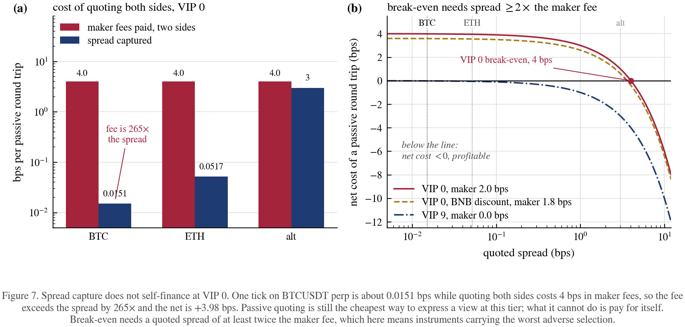

One tick on BTCUSDT perp is about $`0.0151`$ bps while quoting both sides costs
$`4`$ bps in maker fees: the fee exceeds the spread by $`264\times`$, for a net
$`+3.98`$ bps. Note carefully what that does and does not say. Passive quoting is
still the *cheapest* of the three executions at VIP 0 ($`3.98`$ against $`10.02`$ bps
for crossing), so it remains the right way to enter. What it cannot do is pay for
itself: at VIP 0 alpha is required, because the spread alone loses money.

Market making as a spread-capture *business* needs
$`2\times\text{maker fee}\le\text{spread}`$, i.e. a quoted spread of at least
$`4`$ bps at VIP 0. At VIP 9 the same trade is already $`-0.0151`$ bps, a payment
for quoting, which is the entire reason the tier exists. The gap between those two
signs is a business-development problem, not a research problem.

### 13.3 Fees and funding bracket the horizon from both ends

Section 4's floor rewards holding longer, because the edge on a $`\kappa\sigma`$
signal grows as $`\sqrt\tau`$ while a fixed fee does not grow at all. Perpetual
funding does the opposite: it accrues with time. Writing both into one
expression,

```math
\text{net}(\tau)=\kappa\rho\sigma\sqrt\tau-c-f\tau,
```

a downward parabola in $`\sqrt\tau`$. Its peak sits at

```math
\tau^{*}=\left(\frac{\kappa\rho\sigma}{2f}\right)^{2},
\qquad
\text{net}(\tau^{*})=\frac{(\kappa\rho\sigma)^{2}}{4f}-c,
```

so it is positive for **some** $`\tau`$ if and only if

```math
\boxed{\;\rho>\frac{2\sqrt{fc}}{\kappa\sigma}\;}
```

Both closed forms are verified symbolically in the script and unit-tested against
a brute-force grid search.

What the boxed condition governs is the $`\kappa\sigma`$ *reading* of the signal,
which is the quantity the source's floor is also about, and it is stronger than
the source's floor in one specific sense: the source's bound is escapable at any
correlation by holding longer, and this one is not, because carry closes the long
end that fees leave open. Both ends of the horizon are now bracketed, which is
the useful content.

It is not, however, an absolute profitability threshold for the band rule. The
same objection as in §12
applies: under a Gaussian signal the band rule's expected net payoff at a fixed
horizon is

```math
\beta\,\mathbb{E}\!\left[\left(|x|-\frac{c+f\tau}{\beta}\right)^{\!+}\right],
```

which is strictly positive for every $`\beta>0`$ and every finite $`\tau`$, however
small the correlation and however large the carry. Carry raises the band; it does
not eliminate the tail beyond it. The boxed expression is therefore the threshold
below which no $`\kappa=3`$ opportunity exists at any horizon, not the threshold
below which no opportunity exists at all.

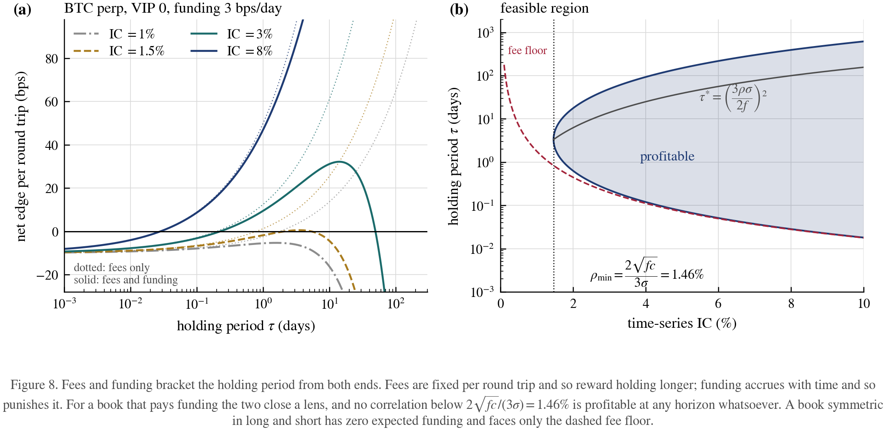

At VIP 0 on BTC with baseline funding of $`3`$ bps/day:


**Table 27.** The horizon-free $`\kappa=3`$ IC floor once funding is paid, by fee tier.

| tier | fee | $`\kappa=3`$ IC floor | best horizon |
|---|---:|---:|---:|
| VIP 0 | $`10.02`$ bps | 1.46% | 3.3 d |
| VIP 0, BNB discount | $`9.02`$ bps | 1.39% | 3.0 d |
| VIP 9 | $`3.42`$ bps | 0.85% | 27.3 h |

**Below a correlation of 1.46% no horizon admits a profitable
three-sigma trade** at retail fees, against 0.85% at the top tier. Sensitivity
to the funding assumption, BTC at VIP 0:


**Table 28.** Sensitivity of the horizon-free floor to the funding assumption.

| funding | $`\kappa=3`$ IC floor | best horizon |
|---|---:|---:|
| $`0`$ bps/day | none: fees alone are escapable by holding longer | unbounded |
| $`1`$ bps/day | 0.84% | 10.0 d |
| $`3`$ bps/day | 1.46% | 3.3 d |
| $`10`$ bps/day | 2.67% | 24.0 h |
| $`30`$ bps/day | 4.62% | 8.0 h |

The caveat matters as much as the result: this assumes the book **pays** funding,
which is the long-biased case. A dollar-neutral book is often said to escape carry
automatically, and that holds only under a condition worth naming. Expected
funding is $`\mathbb{E}\bigl[\sum_i w_i f_i\bigr]`$, which vanishes for
$`\sum_i w_i=0`$ **only if** the rates $`f_i`$ are common across names, or at least
uncorrelated with the weights. Neither is guaranteed. §15.2 measures funding
dispersion across symbols that is large relative to its mean, and a signal that
ranks names is liable to select on the characteristics funding loads on, since a
name in heavy demand tends to be both expensive to hold and conspicuous to a
momentum or carry signal. A cross-sectional book can therefore carry a systematic
funding bill while remaining dollar-neutral, and whether it does is an empirical
property of the signal rather than of the construction. The check is
$`\mathrm{Corr}(w_i,f_i)`$ on the intended book, and this report does not
perform it.

Where the rates are common or that correlation is negligible, a symmetric book
faces only the fee floor and has no upper bound on horizon, with funding
contributing variance rather than drag. Read the boxed floor as the worst case for
a directional book that pays carry, not as a universal law, and as a statement
about three-sigma opportunities rather than about all of them.

### 13.4 What survives at VIP 0

Feeding VIP 0 costs back through §4's retention arithmetic, on BTC:


**Table 29.** Net P&L retention and net information ratio at the retail tier.

| horizon | IC | floor | multiple | net P&L retained | net IR, 100 symbols |
|---|---:|---:|---:|---:|---:|
| 1 h | 3% | 6.54% | $`0.46\times`$ | 0.00% | $`0.00`$ |
| 1 h | 5% | 6.54% | $`0.76\times`$ | 0.00% | $`0.10`$ |
| 1 h | 10% | 6.54% | $`1.53\times`$ | 2.36% | $`7.88`$ |
| 4 h | 3% | 3.27% | $`0.92\times`$ | 0.04% | $`0.12`$ |
| 4 h | 5% | 3.27% | $`1.53\times`$ | 2.36% | $`1.97`$ |
| 4 h | 10% | 3.27% | $`3.06\times`$ | 21.66% | $`14.12`$ |
| 1 day | 3% | 1.33% | $`2.25\times`$ | 10.59% | $`1.14`$ |
| 1 day | 5% | 1.33% | $`3.75\times`$ | 30.08% | $`3.52`$ |
| 1 day | 10% | 1.33% | $`7.49\times`$ | 57.72% | $`10.58`$ |
| 3 days | 3% | 0.77% | $`3.89\times`$ | 31.72% | $`1.26`$ |
| 3 days | 5% | 0.77% | $`6.49\times`$ | 52.55% | $`2.88`$ |
| 3 days | 10% | 0.77% | $`12.98\times`$ | 73.68% | $`7.16`$ |

The last column assumes $`100`$ symbols with independent alphas and should be
divided by roughly $`\sqrt{1+(N-1)\rho_\alpha}`$ before being believed: see
§7E. The first column is the one to take seriously: at VIP 0 a 3% IC at a
one-hour horizon keeps essentially none of its gross edge, and the same signal
held a day keeps a tenth of it.

## 14. Cross-sectional IC: a different metric, a different floor

`scripts/cross_sectional_ic.py`. Everything above is a **time-series** statement:
one asset, does the signal predict its own next return. A cross-sectional book
asks whether the signal *ranks* assets against each other at a point in time.
The two are routinely confused, and a panel decomposition separates them.

### 14.1 The common component and the cross-sectional component, and why the pooled number is neither

Decompose a balanced panel into date means and deviations from them,

```math
x_{it}=\bar x_{t}+\tilde x_{it},\qquad
y_{it}=\bar y_{t}+\tilde y_{it},\qquad
\sum_i\tilde x_{it}=\sum_i\tilde y_{it}=0 .
```

Pooled covariance splits exactly into a between-date and a within-date piece,

```math
\mathrm{Cov}_{t,i}(x,y)=
\mathrm{Cov}_{t}(\bar x_{t},\bar y_{t})
+\mathbb{E}_{t}\!\left[\mathrm{Cov}_{i}(x_{it},y_{it})\right],
```

so the pooled number is a sum of a between-date and a within-date contribution and
is neither of them.

Two *statistics* are built from those pieces, and they have to be kept distinct
from the decomposition itself, because the decomposition is about **covariances**
while an IC is a **correlation**:

* the **common-component IC**, or market-timing IC,
  $`\mathrm{Corr}_t(\bar x_t,\bar y_t)`$, which normalises the first term by
  the standard deviations of the date means;
* the **cross-sectional IC**, which as implemented here and as ordinarily reported
  is the mean over dates of the date-wise correlation,
  $`\mathbb{E}_t[\mathrm{Corr}_i(x_{it},y_{it})]`$.

The second is **not** the within-date covariance term rescaled, and an earlier
version of this report treated it as though it were. Averaging correlations
normalises inside each date, so every date contributes equally whatever its
cross-sectional spread; the covariance term instead lets high-dispersion dates
dominate. The two agree only when the cross-sectional standard deviations of $`x`$
and $`y`$ are constant through time, and in a real panel they are not: §15.1
measures 2026 dispersion varying enough for the distinction to matter.

What the decomposition does establish is that the between-date and within-date
*covariance* contributions are orthogonal pieces of the pooled covariance, so
neither constrains the other. The simulation below exhibits the corresponding
independence of the two reported ICs on a panel built as
common-plus-cross-sectional with constant dispersion, which is the case where the
correlation statistics and the covariance terms coincide.

One clarification is easily elided. The common-component IC is *not* the general time-series IC. A conventional
time-series IC is measured through time for a single asset,
$`\mathrm{Corr}_t(x_{it},y_{i,t+\tau})`$, and it can be substantially positive
while every date mean is zero: give each asset its own persistent
signal-return relationship with signs that cancel across the panel, and the
common component vanishes while every per-asset time-series IC stays positive.
Sections 3 through 13 are statements about that per-asset quantity. The
orthogonality demonstrated below is between the common component and the
cross-sectional component, which is the decomposition above, and it does not
extend to a general claim that time-series and cross-sectional IC cannot
constrain each other.

Simulated panels with the common and cross-sectional components set
independently, which is the case the decomposition covers:


**Table 30.** Common-component and cross-sectional IC measured on the same simulated panels. The "TS" columns are the date-mean statistic, not a per-asset time-series IC.

| signal | target TS | target CS | measured TS IC | measured CS IC | pooled |
|---|---:|---:|---:|---:|---:|
| market timing only | 4.0% | 0.0% | 4.86% $`\pm`$ 0.71 | 0.13% $`\pm`$ 0.050 | 1.48% |
| mostly timing | 4.0% | 2.0% | 4.00% $`\pm`$ 0.71 | 2.09% $`\pm`$ 0.050 | 2.51% |
| balanced | 3.0% | 3.0% | 4.35% $`\pm`$ 0.71 | 2.95% $`\pm`$ 0.050 | 3.16% |
| mostly ranking | 2.0% | 4.0% | 3.19% $`\pm`$ 0.71 | 4.09% $`\pm`$ 0.050 | 3.57% |
| ranking only | 0.0% | 4.0% | 0.42% $`\pm`$ 0.71 | 3.99% $`\pm`$ 0.050 | 2.71% |

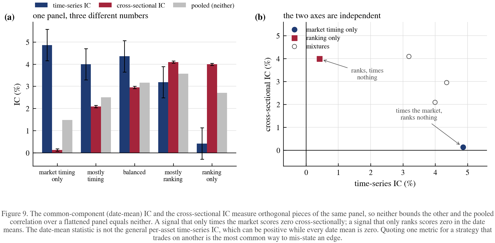

A signal that only times the market scores zero cross-sectionally; one that only
ranks scores zero in the date means. The pooled correlation over a flattened
panel is neither, and quoting it, or quoting the wrong one of the two, is the
most common way to mis-state an edge. The demonstration establishes independence
for a panel constructed as common-plus-cross-sectional, which is what the
decomposition assumes, and not for an arbitrary panel. Note also the error bars: both come from
the same panel, but the time-series estimate uses $`T`$ dates while the
cross-sectional one uses $`NT`$ cells, so it is $`\sqrt{N}\approx14`$ times
tighter. That is §14.4 arriving early.

### 14.2 Three floors, not one

A dollar-neutral book earns the **dispersion** of returns, not their level,
because the common move cancels.

One parameter, not two. In a one-factor market with **equal loadings**, an
asset-to-factor correlation $`q`$ implies a pairwise correlation $`\rho_r=q^{2}`$, and
these are different numbers. With unequal loadings the relation is
$`\rho_{ij}=q_iq_j`$, and even that presumes the idiosyncratic residuals are
mutually uncorrelated; where they are not, an additional residual-covariance term
appears and no function of the $`q_i`$ alone determines $`\rho_{ij}`$. So $`q^{2}`$ is
the value at a common $`q`$ under uncorrelated residuals rather than a general
identity; §15.1 finds the loadings are in fact heterogeneous, so this
subsection describes the homogeneous idealisation §14 works in.
Dispersion needs one and breadth needs the other, so quoting a single figure for
"the correlation" gets one of them wrong, as using $`0.70`$ for both would.

**A third correlation, and the one breadth actually needs.** §7E derives
$`BR_{\text{eff}}=N/[1+(N-1)\rho_\alpha]`$ from the correlation of the *alphas*.
Substituting a *return* correlation $`\rho_r`$ into that formula is not a
conservative approximation; it is a different quantity. Grinold-Kahn breadth counts independent P&L streams, and
those are governed by how the forecasts co-move, not by how the assets do. The
two come apart entirely. Take

```math
y_i=\beta x_i+\gamma f+\varepsilon_i,\qquad
x_i,\;f,\;\varepsilon_i\ \text{all independent}.
```

The shared factor $`f`$ makes the returns correlate arbitrarily close to $`1`$ as
$`\gamma`$ grows, while the proportional-rule P&Ls $`x_iy_i`$ stay uncorrelated
across names, so breadth remains $`N`$. Simulated at $`N=40`$, $`\gamma=10`$: measured
return correlation $`0.990`$, measured P&L correlation $`-0.00006`$, true breadth
$`39.9`$, and the return-correlation formula returns $`1.01`$. It is wrong by a
factor of $`N`$. This is a counterexample in the sense of §7 and is carried as a
unit test.

The return-correlation formula *is* right for one case, and it is worth naming
precisely: a book holding the **same position in every name**. Then the per-name
P&L is $`h\,y_i`$ for common $`h`$, the P&L streams inherit the return correlation
exactly, and

```math
q=\sqrt{\rho_r},\qquad
BR_{\text{common position}}=\frac{N}{1+(N-1)\rho_r}
```

counts correctly, saturating at $`1/\rho_r`$. A market-timing book that tilts the
whole universe on one signal is this case. A cross-sectional book with a forecast
per name is not, and nothing in this section measures its $`\rho_\alpha`$.

Dispersion, however, is **measured rather than derived**, because §15.1 shows the
one-factor prediction $`\sigma\sqrt{1-\rho_r}`$ underpredicts 2026 dispersion by
20% once the comparison is made on matched moments.

Alt perp, 2026 calibration: median single-name vol 5.19%/day,
mean pairwise $`\rho_r=0.3103`$, measured dispersion 6.60%/day;
$`13`$ bps round trip at VIP 0:


**Table 31.** Three floors for a cross-sectional book.

| horizon | directional | per name, CS | whole section, turnover 2 | whole section, turnover 1.41 |
|---|---:|---:|---:|---:|
| 1 h | 4.09% | 3.22% | 7.70% | 5.44% |
| 4 h | 2.05% | 1.61% | 3.85% | 2.72% |
| 1 day | 0.83% | 0.66% | 1.57% | 1.11% |
| 3 days | 0.48% | 0.38% | 0.91% | 0.64% |
| 1 week | 0.32% | 0.25% | 0.59% | 0.42% |
| 1 month | 0.15% | 0.12% | 0.29% | 0.20% |

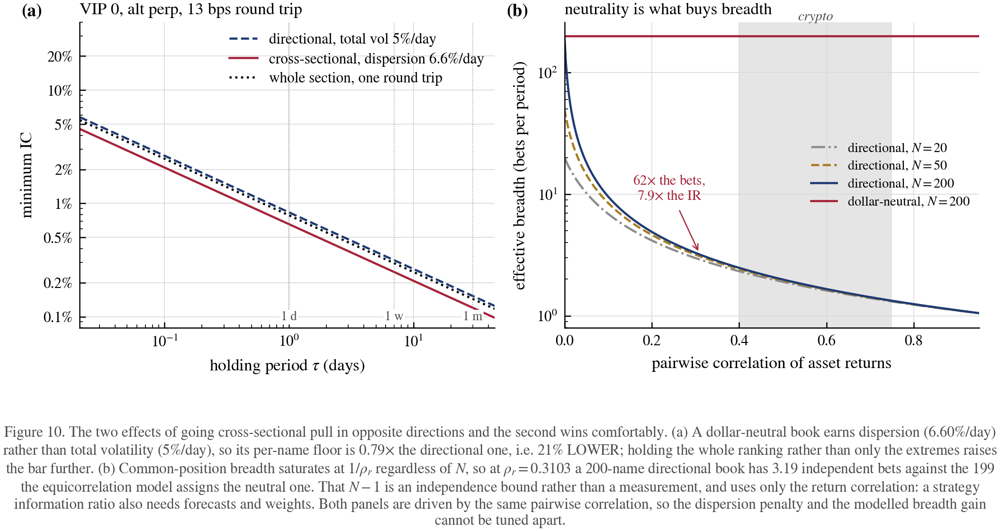

Note the second column is **below** the first. Measured dispersion
(6.60%) exceeds median single-name volatility
(5.19%), because cross-sectional spread is driven by the right
tail of the volatility distribution rather than its middle. The comparison of
those two figures is between a cross-sectional and a per-name aggregation and is
descriptive rather than a model test; §15.1 makes the matched comparison, where
the one-factor description underpredicts dispersion by 20%. What that leaves
is a dispersion *advantage* rather than the $`1.19\times`$ penalty a one-factor
market with equal loadings predicts. What remains is the portfolio effect:
holding the whole ranking rather than only the extremes costs
$`\kappa/\sqrt{\pi/2}=2.39`$ times at one full round trip, or $`1.69`$ at the
$`1.41`$ turnover a signal-weighted book actually runs.

### 14.3 Breadth is the reason for going cross-sectional

Directional positions all load on the common factor, so effective breadth
saturates at $`1/\rho_r`$ *however many names are held*. Dollar-neutral positions
cancel that factor and recover roughly $`N`$:


**Table 32.** Sensitivity of breadth and portfolio break-even to the pairwise correlation.

| pairwise $`\rho_r`$ | factor $`q`$ | dispersion (one-factor) | directional breadth | IR ratio | portfolio break-even |
|---:|---:|---:|---:|---:|---:|
| $`0.20`$ | $`0.45`$ | 4.64% | $`4.90`$ | $`6.4\times`$ | 1.58% |
| $`0.31`$ | $`0.56`$ | 4.31% | $`3.19`$ | $`7.9\times`$ | 1.70% |
| $`0.40`$ | $`0.63`$ | 4.02% | $`2.48`$ | $`9.0\times`$ | 1.82% |
| $`0.49`$ | $`0.70`$ | 3.71% | $`2.03`$ | $`9.9\times`$ | 1.98% |
| $`0.55`$ | $`0.74`$ | 3.48% | $`1.81`$ | $`10.5\times`$ | 2.11% |
| $`0.70`$ | $`0.84`$ | 2.84% | $`1.43`$ | $`11.8\times`$ | 2.58% |
| $`0.80`$ | $`0.89`$ | 2.32% | $`1.25`$ | $`12.6\times`$ | 3.16% |

At the 2026 mean $`\rho_r=0.3103`$ a 200-name **common-position** book has $`3.19`$
effective bets, and adding names does not help because the ceiling is
$`1/\rho_r=3.22`$. That figure is sound for a book tilting every name together,
and it is the honest content of the column.

**The $`7.9\times`$ information-ratio ratio is withdrawn.** It divided
$`\sqrt{N-1}`$ by $`\sqrt{BR_{\text{common position}}}`$, which compares a
degree-of-freedom ceiling against a common-position risk statistic and calls the
result a strategy ratio. Neither term is a forecast breadth, so their ratio is
not an information-ratio gain, and calling it "a model construction" does not
supply the forecast covariance, weights and ICs that such a claim needs. The column is retained in Table 32 as the ratio of the two
*modelled* quantities it literally computes, and no strategy conclusion is drawn
from it.

The pairwise figure used throughout §14 is the **mean** off-diagonal correlation
of the 2026 universe, $`0.3103`$, for the reason §15.1 gives: the mean is the
sufficient statistic for equal-weighted risk concentration and the median,
$`0.291`$ on the same window, is not. It is the **proxy used here** rather than
"the right input": a pairwise-deletion estimate from $`136`$ eligible symbols,
applied to an $`N=200`$ construction. Note also that the mean over the broad $`136`$-symbol universe
($`0.3103`$) and the mean over the $`65`$-symbol complete-case block of §15.1
($`0.4996`$) are different populations, not competing estimates of one number: the
complete-case block excludes exactly the newly-listed low-correlation names.
§14's tables describe the broad universe.

Those neutral figures are **what the equicorrelation model assigns, not
measurements.** $`N-1`$ is the count of degrees of freedom left after demeaning,
so it is an independence bound on the number of available bets, and §15.1 reports
a related but distinct quantity beside it: the participation ratio of the residual
return covariance, $`8.50`$ on the 2026 complete-case universe against a rank of
$`64`$.

The participation ratio is a **spectral-concentration diagnostic and nothing
more**. The temptation to extract a breadth statement from it is strong, and the
reason that fails is worth recording.

Grinold-Kahn breadth counts independent *bets*, which depends on the covariance
of the forecasts, on the portfolio weights, and on how both relate to returns.
None of those appear in $`M\Sigma M`$. That $`M\Sigma M`$ on the 2026 universe has
**rank $`64`$**, so that its positive-eigenvalue directions whiten into $`64`$
mutually uncorrelated unit-*risk* directions, shows only that the participation
ratio is not a ceiling on how many uncorrelated risk directions exist. It does
**not** show that $`64`$ independent bets are available: that would additionally
require a forecast along each direction whose errors are themselves
uncorrelated, and a return covariance cannot speak to whether such forecasts
exist or are profitable. The correct reading is that the participation ratio is
silent on breadth in *both* directions. It neither caps it nor delivers it, and
what it does measure is that risk is unevenly distributed across the residual
directions, with a few carrying most of the variance.

That distinction kills both of the inferences previously drawn here. The
$`\sqrt{8.50/1.971}`$ conversion into an information-ratio advantage is withdrawn,
and so is the weaker claim that $`N-1`$ is shown to be far from tight. Neither
follows from a return covariance alone.

What the ratio legitimately says is that a book weighting the residual directions
*equally* concentrates its risk in about eight of them, so equal weighting is a
poor way to spend a neutral book's risk budget, and the low-variance directions
need either leverage or a forecast strong enough to justify the estimation noise
they carry. Whether $`64`$, or $`8`$, or something between, is achievable is a
portfolio-construction question requiring a forecast, a weighting rule, and their
joint distribution with returns. This report does not answer it.

**Table 32's $`7.9\times`$ is a model construction, not a measurement.** It divides
$`\sqrt{N-1}`$ by $`\sqrt{BR_{\text{directional}}}`$ under equicorrelation, so it
inherits both the $`N-1`$ independence assumption and the equal-weight,
equal-variance idealisation, and it uses only the *return* correlation. A
strategy information-ratio ratio additionally requires forecasts and weights.
Read the column as what the equicorrelation model implies, which is how §14 uses
it, and not as an attainable figure.

**In a correlated market, cross-sectional construction is not a style preference.
It is the strongest lever the *return* covariance offers.** That conclusion rests on the
mechanism, which the measurements leave intact: a directional book saturates at
$`1/\rho_r`$ however many names it holds, a ceiling of $`3.22`$ at the 2026 mean, and
demeaning removes the factor causing that saturation. Calling it the *only* way to
buy breadth was too strong, since signal diversification and horizon
diversification also add bets. What the measurements remove is confidence in the
*size* of the advantage, not its direction. Note also the direction of the 2026
move, stated carefully because §15.1 shows it is composition rather than regime:
as the eligible universe came to contain more weakly correlated names, the
modelled ceiling fell from $`10.5\times`$ at $`\rho_r=0.55`$ to $`7.9\times`$ at
$`0.31`$. A universe of less correlated names leaves a common-position book more
risk diversification of its own. The argument for neutrality is strongest exactly
where names move together.

### 14.4 End to end, and what it costs to measure

A simulated dollar-neutral book, $`N=200`$, daily rebalance, VIP 0 fees, 2026
dispersion:


**Table 33.** Simulated dollar-neutral book at the retail tier.

| realised CS IC | turnover | gross | fees | net | net IR |
|---:|---:|---:|---:|---:|---:|
| 0.52% | $`1.42`$ | $`4.33`$ | $`9.20`$ | $`-4.87 \pm 0.76`$ | $`-1.58`$ |
| 1.18% | $`1.41`$ | $`9.77`$ | $`9.18`$ | $`+0.59 \pm 0.75`$ | $`+0.19`$ |
| 1.73% | $`1.41`$ | $`14.34`$ | $`9.20`$ | $`+5.15 \pm 0.75`$ | $`+1.70`$ |
| 2.58% | $`1.41`$ | $`21.26`$ | $`9.19`$ | $`+12.06 \pm 0.76`$ | $`+3.90`$ |
| 2.88% | $`1.41`$ | $`23.75`$ | $`9.19`$ | $`+14.56 \pm 0.75`$ | $`+4.78`$ |
| 5.04% | $`1.41`$ | $`41.70`$ | $`9.19`$ | $`+32.51 \pm 0.77`$ | $`+10.44`$ |
| 8.13% | $`1.41`$ | $`67.31`$ | $`9.19`$ | $`+58.12 \pm 0.76`$ | $`+18.87`$ |

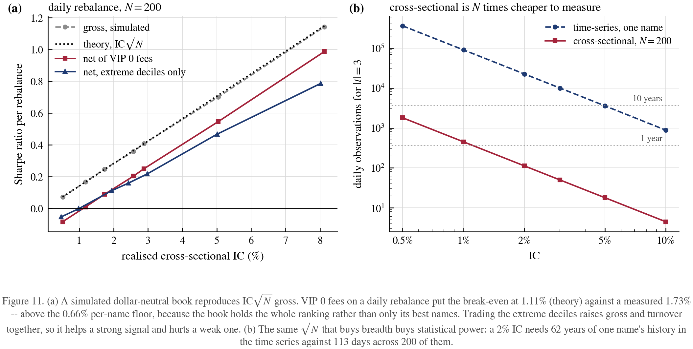

Gross Sharpe reproduces $`\mathrm{IC}\sqrt{N}`$ to within simulation noise, and
the break-even lands where theory says it should. Trading
only the extreme deciles, the cross-sectional no-trade band, raises gross and
turnover together, so it helps a strong signal and hurts a weak one.

Measurement is where cross-sectional wins outright:


**Table 34.** Data required to establish an information coefficient in each metric.

| IC | TS observations, one name | as years | CS dates, $`N=200`$ | as months |
|---:|---:|---:|---:|---:|
| 0.5% | $`359,983`$ | $`986`$ y | $`1,800`$ | $`60.0`$ m |
| 1.0% | $`89,983`$ | $`247`$ y | $`450`$ | $`15.0`$ m |
| 2.0% | $`22,483`$ | $`62`$ y | $`113`$ | $`3.8`$ m |
| 3.0% | $`9,983`$ | $`27`$ y | $`50`$ | $`1.7`$ m |
| 5.0% | $`3,583`$ | $`10`$ y | $`18`$ | $`0.6`$ m |
| 10.0% | $`883`$ | $`2`$ y | $`4`$ | $`0.1`$ m |

At the table's $`t=3`$ target the exact ratio used by the code is
$`N[(1-\mathrm{IC}^{2})^{2}+\mathrm{IC}^{2}/9]`$, i.e. $`N`$ to within
$`O(\mathrm{IC}^{2})`$. A 2% IC needs $`62`$ years of one name's history in the
time series against $`113`$ days across two hundred of them.

Two caveats. This assumes a **stable** IC, so that the per-date dispersion is
$`1/\sqrt N`$; measured IC series are far noisier because the true IC moves, and it
is that instability rather than sampling error that usually binds: use the
measured $`\mathrm{sd}(\mathrm{IC}_t)`$, not $`1/\sqrt N`$. And the breadth figure
assumes residuals are independent once the common factor is removed; sector and
beta clusters inside crypto (L1s, memecoins, exchange tokens) leave more
structure than that, so treat $`199`$ as an upper bound and §7E's haircut as the
correction.

## 15. Calibration: the assumed parameters, measured on 2026 data

`scripts/calibrate_from_data.py`. Sections 12-14 were written on order-of-
magnitude guesses. This section replaces each with a measurement on the Binance
USDT-perpetual record: 788 symbols of hourly klines, minute klines, and the
monthly funding archives. Delisted symbols are present and the universe is
rebuilt from trailing volume at every date, using no same-day information, which
removes the classic current-constituent form of survivorship bias.

It does not remove all selection, and the residual form matters for the
comparisons that follow. A symbol enters a window only if it has enough
observations *across that whole window*, so short-lived and late-listed symbols
are excluded rather than partially included:

```python
counts = r.notna().sum()
keep = counts[counts >= min_obs].index
```

That is full-window longevity selection. The estimates below are therefore
conditional on surviving the window, which is a weaker but real bias in the same
direction. Two consequences are worth stating rather than buried. First, the
window-to-window comparison changes the eligible universe as well as the regime:
$`136`$, $`131`$ and $`97`$ symbols respectively. So a fall in measured correlation
mixes a within-symbol change with a change in universe composition. **Table 35a
separates them**, and finds composition dominant: incumbent correlation moved
-6.1% while the broad mean roughly halved. A point-in-time rolling
correlation for the dynamic universe would add a third view and is outside this
section. Second, any uncertainty interval on a correlation should
be computed across dates, not by treating thousands of pairwise correlations as
independent draws, since they share the same underlying dates and factor.

**The calibration window is 2026 only.** Crypto's volatility and correlation
regime has moved far enough that pooling 2020-21 into an estimate of "normal"
misleads. The older windows below are reported for one purpose: to show the size
of the shift. That is a weaker justification than it first appears:
Table 35a shows the shift is largely a change in which symbols are eligible
rather than in how the persistent ones behave, so the case for the recent window
rests on it describing the universe a book would trade today, not on the older
data having been invalidated by a regime change.

### 15.1 Volatility, correlation and dispersion

Point-in-time top 200 by trailing 30-day volume, daily log returns:


**Table 35.** Measured volatility, correlation and dispersion, by window.

| window | days | symbols | BTC vol | ETH vol | median vol | pairwise $`\rho_r`$ | dispersion | one-factor prediction | ratio |
|---|---:|---:|---:|---:|---:|---:|---:|---:|---:|
| 2026 only | 203 | 136 | 2.50% | 3.36% | 5.19% | $`0.291`$ | 6.60% | 4.37% | $`1.51\times`$ |
| 2024-2025 | 731 | 131 | 2.49% | 3.64% | 5.87% | $`0.598`$ | 3.40% | 3.72% | $`0.92\times`$ |
| full sample | 2395 | 97 | 3.24% | 4.34% | 6.12% | $`0.586`$ | 3.16% | 3.94% | $`0.80\times`$ |

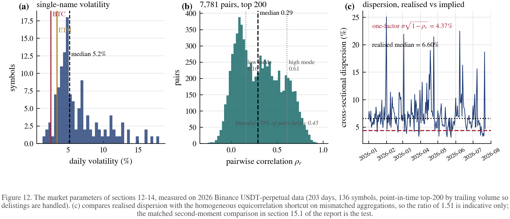

Volatility has fallen and then stabilised: BTC ran at 3.24%/day over the full
sample and 2.50%/day in 2026. The broad-universe correlation appears to move
far more: median pairwise $`\rho_r`$ was $`0.586`$ over the full sample and $`0.598`$
through 2024-25 against $`0.291`$ in 2026, with means $`0.581`$ and $`0.310`$.

**That apparent halving is mostly composition, not regime**, and an earlier
version of this report drew the opposite conclusion from it. Holding the universe
fixed to the names eligible in both windows settles it:

**Table 35a.** Matched cohort, and the exact decomposition of the 2026 mean. Both windows use the same overlap rule as the broad estimator, $`402`$ observations for 2024-2025 and $`111`$ for 2026.

| group | pairs | 2024-2025 mean $`\rho_r`$ | 2026 mean $`\rho_r`$ |
|---|---:|---:|---:|
| the $`63`$ names eligible in both windows | $`1{,}902`$ / $`1{,}941`$ | $`0.60958`$ | $`0.57245`$ |
| the $`73`$ names eligible in 2026 only, among themselves | $`1{,}609`$ | | $`0.14853`$ |
| incumbents against entrants | $`4{,}231`$ | | $`0.25160`$ |
| **pair-weighted total** | $`\mathbf{7{,}781}`$ | | $`\mathbf{0.31033}`$ |

The three 2026 groups partition every pair the broad estimator uses, so the last
row *is* the broad-universe figure: $`0.31033`$ against the $`0.310325`$ of Table 35,
agreeing to five decimal places. This is an exact decomposition rather than a
loose comparison, and it requires the cohort calculation to use the same overlap
rule as the broad estimator: a cohort computed at a different minimum overlap
does not reconcile with the figure it is meant to explain.

Incumbent correlation fell by **6.1%**, from $`0.610`$ to $`0.572`$, not by half.
What produces the broad figure of $`0.310`$ is that $`73`$ of the $`136`$ symbols
eligible in 2026 were not eligible in 2024-2025, and those entrants correlate at
$`0.149`$ among themselves and $`0.252`$ with the incumbents, contributing $`5{,}840`$
of the $`7{,}781`$ pairs. The universe got wider and younger; the incumbents barely
moved.

Two consequences follow, and they point in opposite directions. The
$`\rho_r=0.310`$ that §14 uses remains the **proxy used here** for a *book trading
the 2026 top-200*, since that is the universe such a book holds, so the
common-position arithmetic downstream is unaffected. It is a pairwise-deletion
estimate from $`136`$ eligible symbols applied to an $`N=200`$ construction, not an
exact statistic of that book's correlation matrix. But no claim about crypto's internal
correlation regime having changed is supported here, and the sentence that
previously made one is withdrawn. §14 uses the mean throughout, for the reason
given below.

The last three columns look like a **test** of the one-factor assumption but are
not one, and the reason is an aggregation mismatch that would otherwise read as
a 51% model failure. The predicted column is
$`\mathrm{median}(\sigma)\sqrt{1-\mathrm{median}(\rho_r)}`$, while the
measured column is $`\mathrm{median}`$ of the per-date cross-sectional
standard deviation. Medians do not pass through $`\sqrt{1-\rho}`$, so

```math
\mathrm{median}(s_{\mathrm{CS}})\neq
\mathrm{median}(\sigma)\sqrt{1-\mathrm{median}(\rho_r)}
```

even when a one-factor model holds exactly. The ratio therefore measures the
non-commutation of two medians as well as any model error, and the two cannot be
separated in that column. It is kept because it is the figure §14 propagates, and
it is superseded by the matched comparison below.

**Table 35b.** Dispersion compared on matched second moments, complete-case universe.

| window | names $`\times`$ days | measured RMS | predicted, full covariance | ratio | predicted, matched equicorrelation | ratio |
|---|---|---:|---:|---:|---:|---:|
| 2026 only | $`65\times191`$ | 5.14% | 5.14% | $`0.999`$ | 4.29% | $`1.199`$ |
| 2024-2025 | $`51\times612`$ | 3.58% | 3.58% | $`1.000`$ | 3.47% | $`1.032`$ |
| full sample | $`12\times2338`$ | 2.90% | 2.90% | $`1.000`$ | 2.84% | $`1.020`$ |

Both sides are now root-mean-square cross-sectional dispersion over the same
dates and the same names, so the comparison is second moment against second
moment. The covariance column evaluates
$`\sqrt{\mathrm{tr}(M\Sigma M)/(N-1)}`$ with $`M=\mathrm{Id}-\mathbf{1}\mathbf{1}^{\top}/N`$,
which is the exact prediction of the sample covariance matrix; agreement to three
decimal places confirms the arithmetic rather than any economic hypothesis. The
last column is the equicorrelation shortcut given its correct inputs, the *mean*
variance and the *mean* off-diagonal correlation.

That column is the real test, and it changes the verdict twice over: in magnitude,
and in what is being rejected.

In magnitude, the shortfall is 20% on 2026 and $`2`$ to 3% in the earlier
windows, not 51%. In content, what the shortfall rejects is the
**homogeneous equicorrelation shortcut** and not one-factor structure in general.
The quantity $`\sqrt{\overline{\sigma^{2}}(1-\bar\rho)}`$ presumes that every name
shares one volatility and one pairwise correlation. A general one-factor model
$`r_i=\beta_i f+e_i`$ permits heterogeneous loadings $`\beta_i`$ and heterogeneous
residual variances, and it is *not* tested by this comparison: it has enough
freedom to reproduce the measured dispersion, and the 20% gap is consistent
with exactly the heterogeneity the shortcut assumes away. Dispersion loading on
the right tail of the volatility distribution (IQR $`4.27`$ to 8.86%) is the
visible form of it.

So the honest statement is narrow. A single volatility and a single correlation
cannot reproduce 2026 cross-sectional dispersion, which matters because those two
scalars are what §14 propagates. Whether a one-factor market with heterogeneous
betas can is a question this comparison leaves open, and answering it requires
estimating loadings rather than summarising the matrix. The full covariance column
already shows that *some* second-moment structure reproduces dispersion exactly,
which is a hint that the failure is one of parameterisation rather than of factor
structure.

Complete-case selection drops $`71`$ of $`136`$ symbols in the 2026 window, so this
comparison is made on the longest-listed names and is not a statement about the
newest listings.

**And a single $`\rho_r`$ is a poor summary, because the distribution is bimodal.**
Panel (b) shows two clusters: 70% of
pairs near $`0.16`$ and the rest near
$`0.61`$, with the median falling in the trough
between them. Naming the two modes "newly listed" and "established", with the
second at $`0.6+`$, would be wrong on both counts. The split is made on a $`0.45`$
correlation threshold with no listing date entering the calculation, so such a
label asserts the explanation from the measurement; and the assets usually named
average $`0.455`$ to $`0.499`$, not $`0.6+`$, while the most
correlated symbol in the 2026 universe is `SPXUSDT` at $`0.631`$ followed by
`USELESSUSDT` at $`0.512`$, which is not an established large-cap by any reading.

What *can* be said with the dates actually used is Table 35a: incumbents eligible
in both windows sit at $`0.572`$ in 2026, the $`73`$ entrants at $`0.149`$ among
themselves, and the cross pairs at $`0.252`$. That is a real and measured
composition split, and it is the one this report relies on. The practical
consequence survives the correction: sub-universe correlation is a design
parameter rather than a market constant, and **market-neutral construction helps
most exactly where names move together.**

Bimodality also settles which summary the breadth formula may take, and it is not
the median. Expanding the exact expression for an equally weighted book,

```math
BR_{\text{eff}}=\frac{N^{2}}{\mathbf{1}^{\top}C\,\mathbf{1}}
=\frac{N}{1+(N-1)\bar\rho_{\text{off}}},
```

shows that the **mean** off-diagonal correlation is not a convenient summary of
the matrix but its sufficient statistic for this purpose. One caveat on the word
"exact": the identity requires a single jointly observed, complete $`N\times N`$
matrix, whereas the $`0.3103`$ is a pairwise-deletion estimate over the $`7{,}781`$
of $`\binom{136}{2}=9{,}180`$ pairs with enough overlap, and it is then applied to
an $`N=200`$ construction. It is a sound descriptive estimate of the universe's
mean pairwise correlation, and it is the right functional to estimate; it is not
the exact statistic of a matrix that was never fully observed. A median is a
different number with no such property, and a median is least defensible exactly
when it falls in a trough that no part of the book occupies. On the 2026
complete-case universe the two give $`0.4996`$ and $`0.5266`$, and the resulting
breadths are $`1.971`$ against $`1.873`$, a 5% error. Small here, and small for the
wrong reason: the two clusters happen to be near-symmetric about the median. The
tables of §14 use the mean.

**Table 35c.** Equal-weight breadth from the correlation matrix against the two scalar summaries, with the residual spectral diagnostic beside it.

| window | $`N`$ | $`BR`$ from matrix | via mean $`\rho`$ | via median $`\rho`$ | residual participation ratio | rank of $`M\Sigma M`$, computed |
|---|---:|---:|---:|---:|---:|---:|
| 2026 only | $`65`$ | $`1.971`$ | $`1.971`$ | $`1.873`$ | $`8.50`$ | $`64`$ |
| 2024-2025 | $`51`$ | $`1.646`$ | $`1.646`$ | $`1.625`$ | $`22.35`$ | $`50`$ |
| full sample | $`12`$ | $`1.453`$ | $`1.453`$ | $`1.461`$ | $`8.76`$ | $`11`$ |

The matrix and mean columns agree to every digit shown, as the algebra requires,
and those three columns are the directional equal-weight breadth §14 uses.

The last two columns are **not** breadth and are labelled so deliberately. The
participation ratio $`(\mathrm{tr}R)^{2}/\mathrm{tr}(R^{2})`$ of the
demeaned residual covariance $`R=M\Sigma M`$ measures how evenly risk is spread
across the residual directions. It attains its maximum of $`N-1`$ when $`R=\lambda M`$,
that is when the covariance is isotropic on the neutral subspace; it is *not* a
statement about the residuals being mutually uncorrelated, which demeaned
residuals cannot be, since they sum to zero by construction.

$`R`$ has full rank $`N-1`$ on that subspace in every window here, verified
numerically rather than assumed, so its directions whiten into $`N-1`$ uncorrelated
unit-*risk* directions. That establishes only that the participation ratio is no
ceiling on uncorrelated risk directions; whether profitable independent forecasts
exist along them is a separate question that no return covariance answers. What
the ratio does diagnose is that an equally weighted neutral book would
concentrate its risk in
about eight directions in 2026 and about twenty-two in 2024-2025, which is a
statement about risk allocation rather than about attainable breadth. §14.3 draws
no information-ratio conclusion from it.

### 15.2 Funding is not 8-hourly, and its mean is not its median

All $`480`$ symbols eligible in the 2026 window, $`422{,}326`$ settlements,
$`77{,}647`$ symbol-days, the whole eligible set. Restricting to an alphabetical
prefix, as a convenience sample might, is arbitrary with respect to everything
that matters here and biases funding magnitude, since magnitude is related to
size; every figure below moves under such a cut.


**Table 36.** Funding statistics for 2026, under both weightings.

| statistic | per settlement | per symbol-day |
|---|---:|---:|
| observations | $`422{,}326`$ | $`77{,}647`$ |
| signed mean | $`-13.21`$ bps/day | $`-4.95`$ bps/day |
| signed median | $`3.00`$ bps/day | $`2.29`$ bps/day |
| mean $`\lvert\mathrm{rate}\rvert`$ | $`20.93`$ bps/day | $`11.49`$ bps/day |
| median $`\lvert\mathrm{rate}\rvert`$ | $`3.00`$ bps/day | $`3.00`$ bps/day |
| 90th percentile $`\lvert\mathrm{rate}\rvert`$ | $`24.67`$ bps/day | $`17.61`$ bps/day |
| 99th percentile $`\lvert\mathrm{rate}\rvert`$ | $`398.61`$ bps/day | $`181.86`$ bps/day |

**Which column to read, and why they differ.** The first averages over settlement
rows, so a four-hour contract contributes twice the weight of an eight-hour one
for the same day of exposure. That weighting describes no book: it is the
distribution of settlement *events*. The second sums each symbol-day's
settlements into the funding actually paid that day and weights symbol-days
equally. It is the column to quote, and every figure in it is smaller. The
absolute rows also differ in kind rather than only in weight, since
opposite-signed settlements inside one day offset in a daily total but not in a
mean of absolute per-settlement rates. Neither column is portfolio-weighted;
converting either into the carry a particular book pays needs that book's
exposures, which is why §13.3 treats $`f`$ as a parameter to sweep.


**Table 36b.** Settlement interval, weighted three ways.

| interval | share of settlements | share of contract-hours | share of symbols |
|---|---:|---:|---:|
| 1 h | 3.78% | 0.86% | 0.00% |
| 4 h | 83.21% | 75.53% | 73.75% |
| 8 h | 13.01% | 23.62% | 26.25% |

**The modal contract is on a four-hour schedule, not eight**, and establishing
that needs one of the last two columns rather than the first. Counting
settlements over-represents short intervals, because a four-hour schedule emits
twice the rows of an eight-hour one for the same day of exposure and an hourly
schedule eight times. That bias operates *within* a symbol as well as across
symbols, so taking the mode of a symbol's raw settlement rows does not remove it:
a symbol that spent more days on eight hours than on four can still show four
hours as its modal row.

Weighting each interval by the hours it actually covered fixes it. The third
column assigns every symbol the schedule covering most of its own hours and then
counts symbols equally, giving 73.75% at four hours against 26.25% at eight.
The middle column pools the same exposure across symbols and answers a slightly
different question, what the market as a whole runs on. Both agree that the modal
contract is not on the eight-hour schedule §13.3 assumed.

The columns disagree most instructively on the one-hour row. It is 3.78% of
settlements, only 0.86% of contract-hours, and **not one symbol** among $`480`$
runs predominantly on it. What the interval shares establish is narrower than
"these are not hourly contracts". They are one-hour *schedule observations*, and
what the data shows is
only that no symbol spent most of the window on that schedule, so the rows come
from symbols whose predominant schedule is longer. What causes the switch is *not* settled
here. Compression under extreme funding is the venue's documented mechanism and
the natural reading, but confirming it requires joining the one-hour rows to the
funding rates prevailing around them, which this section does not do. Reading the
event-weighted 3.78% as a population of hourly contracts would in any case be
an error.

**The median absolute rate is exactly $`3.00`$ bps/day under either weighting**,
which is what §13.3 assumed, because that is Binance's baseline and most
settlements sit on it. The median being weighting-invariant is the useful part.
The mean is not: $`20.9`$ per settlement against $`11.5`$ per symbol-day, with 99th
percentiles of $`399`$ and $`182`$, so the distribution is extremely heavy-tailed
either way. §13.3's horizon-free $`\kappa=3`$ floor $`2\sqrt{fc}/(\kappa\sigma)`$ scales as $`\sqrt f`$, so it is
1.5% at the median and 2.8% at the symbol-day mean rather than the 3.8%
the event-weighted mean would imply. The sensitivity table there spans both.

The signed mean is *negative* under either weighting, at $`-4.95`$ bps/day per
symbol-day against $`-13.21`$ event-weighted, so the sign of the conclusion does not
depend on the choice while its magnitude falls by a factor near three. Read it as:
across an equally weighted cross-section of 2026 symbol-days, the average
symbol-day paid shorts rather than longs. That is a statement about symbol-days
and not about any book; inferring that a particular long book was paid needs its
exposures, since funding accrues on position size and the heavy tail sits in the
smaller symbols.

### 15.3 The tick is inferred from observed increments; the spread is not measurable


**Table 37.** Smallest observed close-to-close price increment, an upper bound on the exchange tick.

| symbol | last price | tick | tick, bps |
|---|---:|---:|---:|
| BTCUSDT | 66,082.0000 | 0.1 | $`0.0151`$ |
| ETHUSDT | 1,933.3100 | 0.01 | $`0.0517`$ |
| SOLUSDT | 77.9300 | 0.01 | $`1.2832`$ |
| XRPUSDT | 1.1415 | 0.0001 | $`0.8760`$ |
| DOGEUSDT | 0.0730 | 1e-05 | $`1.3706`$ |
| ADAUSDT | 0.1742 | 0.0001 | $`5.7405`$ |

Tick size in bps moves with price, which is where the assumption drifted. The
figure of $`0.0105`$ bps came from a <span>$</span>95k price, and at <span>$</span>66k the same <span>$</span>0.10 tick is
$`0.0151`$ bps, 44% higher. The quote-skew floor in §12 scales with it.

The quoted spread is a different matter: **a kline archive has no order book**, so
it cannot be measured here at all. Three standard estimators, none of which
recovers it:


**Table 38.** Three spread estimators against the measured tick size.

| symbol | tick | Roll (1 min) | Corwin-Schultz (1 min) | Corwin-Schultz (1 day) |
|---|---:|---:|---:|---:|
| BTCUSDT | $`0.0151`$ | $`1.770`$ | $`0.146`$ | $`42.0`$ |
| ETHUSDT | $`0.0517`$ | $`2.311`$ | $`0.332`$ | n/a |
| SOLUSDT | $`1.2832`$ | $`2.772`$ | $`1.128`$ | $`40.1`$ |
| XRPUSDT | $`0.8760`$ | $`2.613`$ | $`0.683`$ | $`31.8`$ |
| DOGEUSDT | $`1.3706`$ | $`3.544`$ | $`0.928`$ | $`73.3`$ |
| ADAUSDT | $`5.7405`$ | $`5.164`$ | $`2.702`$ | $`103.4`$ |
| LINKUSDT | $`1.1590`$ | $`2.619`$ | $`0.525`$ | $`82.6`$ |
| AVAXUSDT | $`1.5099`$ | $`1.247`$ | $`0.740`$ | $`92.2`$ |

Roll puts BTC's spread at $`117\times`$ its tick; Corwin-Schultz at daily frequency
returns $`42`$ bps, three orders of magnitude too large, because at that horizon it
is measuring volatility rather than bounce. The rank correlation between Roll and
tick size is $`+0.50`$: the
estimators recover the cross-sectional *ordering* and not the level. So the spread
stays an explicit assumption in every script, floored at one tick for the majors,
and getting it right needs book or BBO data this archive does not contain.

### 15.4 What the guesses were worth


**Table 39.** Assumed parameters against measurement.

| parameter | assumed | measured (2026) | error |
|---|---:|---:|---:|
| BTC daily vol | 2.50% | 2.50% | -0.1% |
| ETH daily vol | 3.50% | 3.36% | -4.0% |
| alt daily vol (median) | 6.00% | 5.19% | -13.5% |
| pairwise correlation $`\rho_r`$, median | $`0.550`$ | $`0.290538`$ | -47.2% |
| pairwise correlation $`\rho_r`$, mean (used by §14) | $`0.550`$ | $`0.310325`$ | -43.6% |
| dispersion | 4.02% | 6.60% | +64.1% |
| funding, median \|rate\|, bps/day | $`3`$ | $`3`$ | +0.0% |
| BTC tick, bps | $`0.0105`$ | $`0.0151327`$ | +44.1% |

Volatility, funding and the tick were close or exact. The two misses are the ones
that matter: **the pairwise correlation is half the assumed value**, which weakens
§14's headline multiple, and **dispersion runs above the one-factor prediction**,
which strengthens it by more. The dispersion row compares aggregations that do not
match, so its +64.1% is not a model error; the matched comparison in §15.1 puts
the one-factor shortfall at 20%, and that is the figure to quote. Netted out,
the cross-sectional case survives on a different footing than the one it was
argued on: the per-name floor is lower rather than higher, and the breadth ceiling
is $`7.9\times`$ rather than $`10.5\times`$. That ceiling is not a realisable figure,
and §14.3 declines to convert the measured residual covariance into one, because a
participation ratio of returns is not strategy breadth. No conclusion in §§12-14
reverses; the breadth magnitude is the claim least supported by measurement.

### 15.5 Venue inputs are assumptions, not facts

Every fee, tick, spread and funding figure in §§12-14 is an order-of-magnitude
default for Binance USDT-margined perpetuals in a normal regime, set at the top of
the corresponding script and meant to be replaced. Three of them move in ways that
change conclusions rather than decimals:

* **Fee schedules are revised periodically**, and the BNB discount and any
  market-maker programme terms sit outside the published VIP table. The
  $`2.93\times`$ retail wedge in §13 is a ratio between two rows of one snapshot.
* **Funding settles on a venue- and symbol-dependent interval**: predominantly
  4 or 8 hours on Binance depending on the contract, with one-hour states also
  observed on symbols whose usual schedule is longer, and the interval itself can
  change. The single
  bps/day figure the carry term uses in §13.3 is a smoothed stand-in for a
  discretely settled, time-varying rate, which is why the horizon-free floor
  there comes with a sensitivity table rather than as one number.
* **Spreads and dispersion are regime-dependent**, and both widen exactly when
  volatility spikes and the floor falls. That co-movement is counterexample C, and
  it means a single $`\sigma`$ and a single spread understate the difficulty of the
  states that matter most.

Check the venue's current published schedule before acting on any figure here.

## 16. Reproducing

```bash
make verify        # symbolic checks, worked examples, Monte Carlo, applications
make figures       # report figures from the JSON above
make test          # 63 unit tests on the closed forms and regression mapping
make lean          # Lean/Mathlib proofs of the deterministic algebra
make calibrate     # re-measure the market parameters of Section 15
```

Python 3.13 with the packages in `requirements.txt`. Every target except
`calibrate` is self-contained: no data download, no API keys, no network, because
the source is analytical and so is its verification. Sections 1 to 14 depend on
nothing outside the repository.

Section 15 is the exception. `make calibrate` reads a local archive of Binance
kline and funding files and expects `BINANCE_DATA_DIR` to name the directory
holding `parquet_1h/`, `parquet_1m/` and
`data/futures/um/monthly/fundingRate/`. The archive is roughly ten gigabytes and
is not distributed here; `results/calibration.json` carries the measurements it
produced, so the report is readable and every other target reproducible without
it.

The Lean project is pinned by `lean-toolchain` and `lake-manifest.json`.
`AlphaCorrelationBound/Claims.lean` formally checks the exact correlation
square and inversion, the simple-regression $`R^2=\mathrm{IC}^2`$ identity and
residual-volatility $`R^2`$ floor, the correlation-floor rearrangement and hedge
scaling, band universality, the equity and factor-hedged values, effective
breadth, and the fee-and-funding quadratic optimum. It also pins the one-factor
relation between factor and pairwise correlation and the exact
time-series/cross-sectional sample-size ratio. Empirical inputs, Monte Carlo
output, and decimal Gaussian-tail approximations remain covered by the Python
checks; they are outside the deterministic proof boundary.

`scripts/simulate_bound.py` is the slow one (a few minutes; 4M paths per cell).
Everything else runs in seconds except `scripts/check_algebra.py`, which spends
its time in sympy.

All randomness is seeded. `scripts/simulate_bound.py` uses seed `20240627`, the
thread's publication date; `scripts/counterexamples.py` uses `18061724`. Neither
was chosen after looking at a result, and one consequence is visible in
`figures/fig3_scatter.png`: the middle panel measures 2.78% against a
designed 1.67%, because four thousand observations cannot pin down a number
this small. That is §7D showing up uninvited, and it is left in rather than
reseeded.

## 17. Layout

```
SOURCE.md                         the thread, verbatim, with all images transcribed
README.md                         this file: the frozen mathematics and verdicts
AlphaCorrelationBound/Claims.lean formal proofs of the deterministic algebra
lakefile.toml, lean-toolchain      pinned Lean/Mathlib project
engine.py                         closed forms and simulators
paths.py                          path configuration
Makefile                          verify -> figures -> test
scripts/check_algebra.py          symbolic verification of 15 identities and 1 approximation
scripts/check_examples.py         the three worked numbers, both rules of thumb
scripts/simulate_bound.py         4M-path Monte Carlo; the floor swept; decay
scripts/counterexamples.py        the five failure modes
scripts/crypto_market_making.py   the floor applied to crypto perps, making vs taking
scripts/vip0_fee_analysis.py      the retail tier: fees, funding and the lens
scripts/cross_sectional_ic.py     cross-sectional IC: orthogonality, dispersion, breadth
scripts/r2_regression.py          IC-to-R^2 identities and seeded out-of-sample OLS
scripts/gbm_r2.py                 finite-sample calibration and R^2 = IC^2
scripts/calibrate_from_data.py    measures every assumed market parameter
scripts/_style_academic.py        journal-style figure defaults
scripts/figures.py                report figures
scripts/_style.py                 shared matplotlib style
tests/test_engine.py              63 tests: closed forms, regression, source audit
results/                          JSON and text output from every script
figures/                          generated PNGs
```
